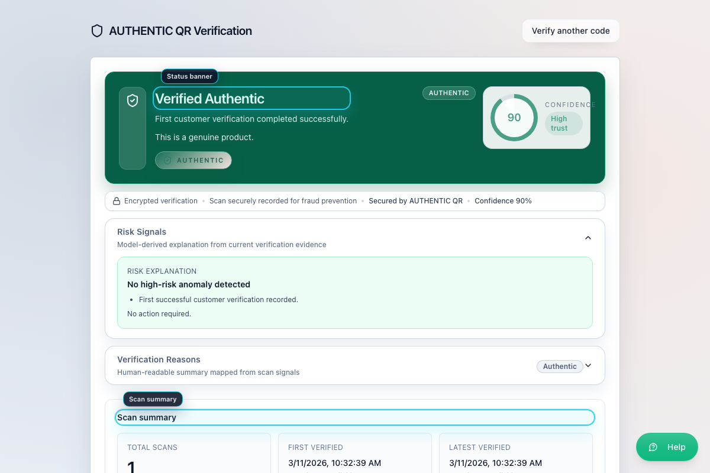
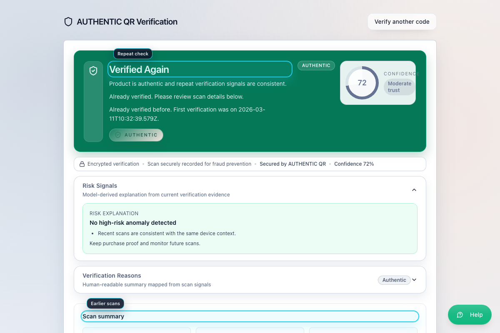
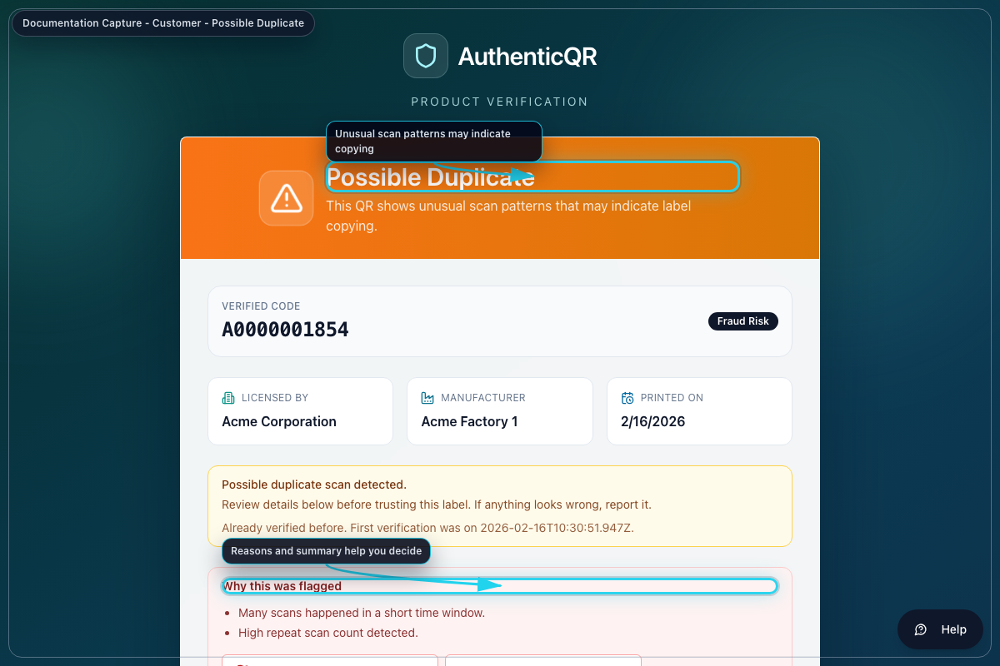
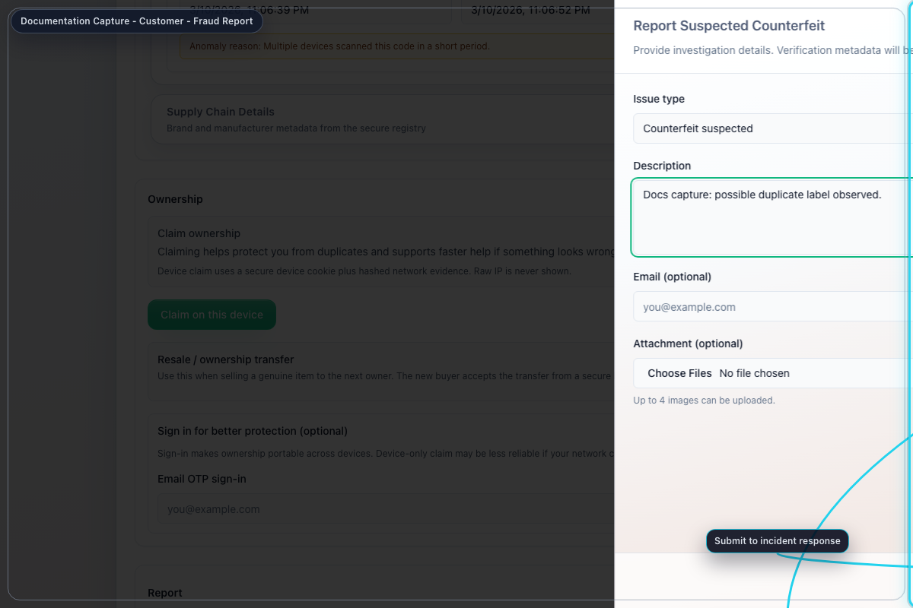

# AuthenticQR Customer Verification Guide

Document ID: AQR-SOP-CU-001  
Version: 1.0  
Last Updated: 2026-02-16

## 1. Purpose
Define the customer-side verification and reporting procedure for authenticity checks.

## 2. Scope
Applies to public verify flow users (no account required).

## 3. Preconditions
- Product QR code is available.
- Internet connection is active.

## 4. Procedure
### 4.1 Verify first scan
1. Scan product QR code.
2. Review status and product details.
3. Confirm `Verified Authentic` outcome.

### 4.2 Validate repeat check behavior
1. Scan the same code again.
2. Confirm `Verified Again` appears.

### 4.3 Handle duplicate warning
1. If `Possible Duplicate` appears, review flag reasons.
2. Do not trust product until reviewed.

### 4.4 Submit suspected counterfeit report
1. Select `Report suspected counterfeit`.
2. Complete incident type and observations.
3. Add optional photos/contact details.
4. Submit report.

## 5. Acceptance Criteria
- Verification screen renders a clear status.
- Duplicate warning displays rationale.
- Report submission returns a reference and audit trail.

## 6. Escalation
- If verification is unavailable, retry and contact brand support.
- If code appears invalid or suspicious, submit report immediately.

## 7. Mandatory Compliance Statements
### 7.1 UK GDPR & Data Protection notice
`{{APP_NAME}}` processes personal data in accordance with UK GDPR and the Data Protection Act 2018. Data protection queries must be directed to `{{DPO_EMAIL}}` or `{{SUPER_ADMIN_EMAIL}}`.

### 7.2 Security & Access Control statement
The platform enforces role-based access control (Super Admin, Licensee, Manufacturer), encrypted HTTPS communication, secure password handling, and audit logging of critical actions.

### 7.3 Incident Response & Fraud Reporting
Controlled process: report intake -> review -> containment -> documentation -> resolution.

### 7.4 QR Code Usage & Non-Duplication policy
All QR codes are unique, traceable, and single-use where applicable. QR codes must not be duplicated, altered, or reused.

### 7.5 Audit Logging notice
Administrative actions, QR allocations, fraud reports, and login attempts are logged and retained for `{{RETENTION_DAYS}}` days.

### 7.6 Acceptable Use clause
Unauthorized access, reverse engineering, misuse of fraud reporting, or interference with system security is prohibited.

### 7.7 Hosting & Disclaimer statement
The platform is hosted via `{{HOSTING_PROVIDER}}` with reasonable security controls and is provided on a best-effort basis.
