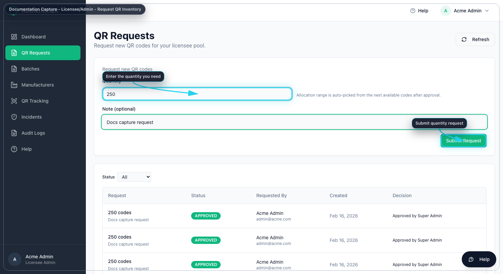
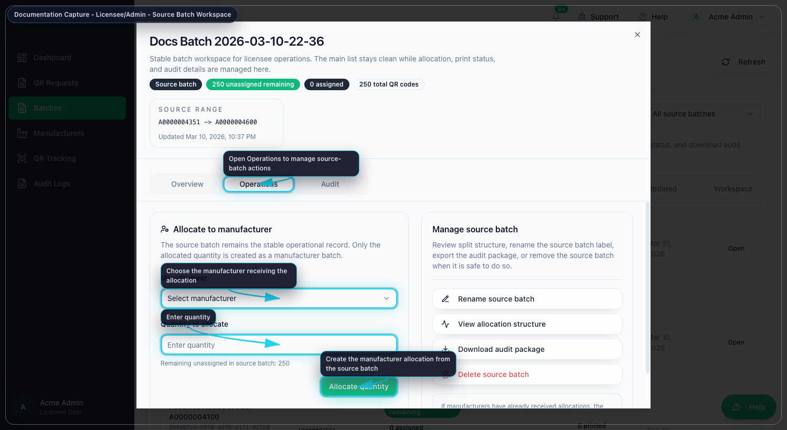
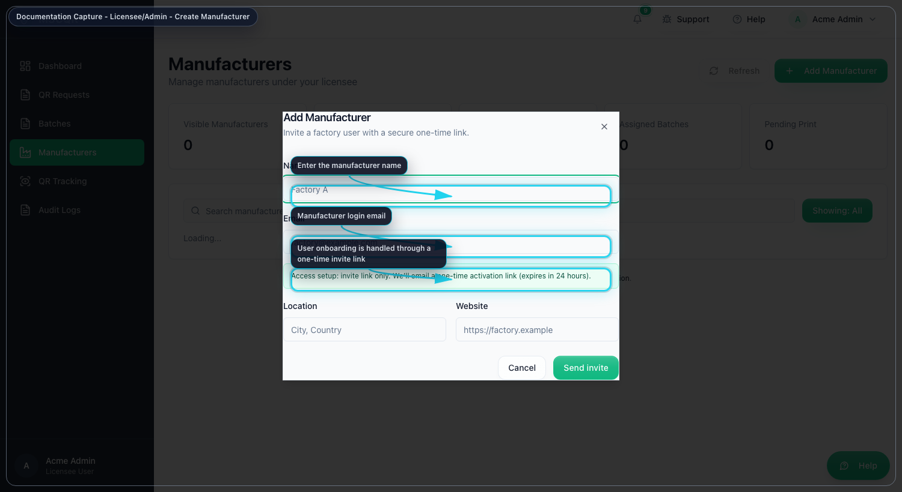

# MSCQR Licensee Admin User Manual

Document ID: AQR-SOP-LA-002  
Version: 2.0  
Last Updated: 2026-03-10

## 1. Purpose
This manual is the current operating guide for the Licensee Admin role. It is written so a Licensee Admin can:
- activate an invited account
- sign in without outside knowledge
- understand every menu item available to the role
- request, assign, trace, and review QR activity in the correct order

## 2. Current Licensee Admin Navigation
After sign-in, the left menu shows:
- `Dashboard`
- `QR Requests`
- `Batches`
- `Manufacturers`
- `QR Tracking`
- `Audit Logs`

The top-right controls show:
- notification bell
- `Support` issue reporter
- `Help`
- user menu with `Account` and `Log out`

## 3. Access, Onboarding, and Sign-In
### 3.1 First-time access from an invite
1. Open the invite link from email.
2. On `Activate your account`, enter your name if required.
3. Enter a password with at least 8 characters.
4. Enter the same password again in `Confirm password`.
5. Select `Activate account`.
6. Wait for the redirect to the dashboard.

### 3.2 Standard sign-in
1. Open the login page.
2. Enter your email address.
3. Enter your password.
4. Select `Sign in`.
5. If MFA is requested, enter the 6-digit code or backup code.
6. Select `Verify MFA`.
7. Confirm the left menu matches the items listed in Section 2.

### 3.3 Forgot password
1. On the login page, select `Forgot password?`
2. Enter your email address.
3. Select `Send reset link`.
4. Open the reset email.
5. Enter the new password twice.
6. Select `Update password`.
7. Return to login and sign in again.

## 4. Common User Menu and Page Controls
### 4.1 Notification bell
Use the bell to open live notifications. Select a notification to open the linked record or page.

### 4.2 Support issue reporter
Select `Support` in the top bar when you need to report an application issue to Super Admin.

Use it in this order:
1. Open the problem page first so the screenshot shows the right state.
2. Select `Support`.
3. Enter a short summary.
4. Describe what you were trying to do.
5. Review the auto-captured screenshot and diagnostics.
6. Select `Send report`.

### 4.3 Help
Select `Help` to open the contextual help page for the current screen.

### 4.4 Account and log out
Open the user menu to:
- select `Account` and update your profile or password
- select `Log out` and end the session

## 5. Dashboard
Purpose: see your organization scope before requesting or assigning stock.

Use `Dashboard` to:
- review QR totals for your organization
- review unassigned inventory
- inspect recent audit activity
- jump quickly to `Batches`, `Manufacturers`, `QR Requests`, or `QR Tracking`

Recommended order:
1. Open `Dashboard`.
2. Check whether unassigned inventory already exists.
3. Review recent activity for unexpected assignments or prints.
4. Move to `QR Requests` only if more stock is required.

## 6. QR Requests
Purpose: request new QR inventory for your organization.

### 6.1 Submit a new request
1. Open `QR Requests`.
2. Enter the `Quantity` required.
3. Enter `Batch name`. This becomes the received batch name after approval.
4. Enter an optional note.
5. Select `Submit Request`.
6. Wait for Super Admin approval.

Result after approval:
- the next available QR sequence is allocated automatically
- the approved request appears in your batch inventory as a received source batch

### 6.2 Track request status
1. Stay on `QR Requests`.
2. Filter by `Status`.
3. Review the request row for quantity, batch name, requester, created date, and decision details.

## 7. Batches
Purpose: manage received source batches and assign controlled quantities to manufacturers.

### 7.1 Understand the Batches page
For Licensee Admin, the main table shows one stable row for each source batch. You do not manage split allocations from the main list. You open the workspace and work inside the three tabs:
- `Overview`
- `Operations`
- `Audit`

### 7.2 Open the source batch workspace
1. Open `Batches`.
2. Search for the source batch or use the assignment filter.
3. Select `Open`.
4. Work from the workspace instead of trying to manage splits from the main list.

### 7.3 Review the source batch in `Overview`
Use `Overview` to confirm:
- original QR quantity
- remaining unassigned quantity
- assigned quantity by manufacturer
- print progress
- redeemed and blocked counts
- source batch identifiers and dates

### 7.4 Allocate quantity to a manufacturer in `Operations`
1. Open the source batch workspace.
2. Open `Operations`.
3. In `Allocate to manufacturer`, select the manufacturer.
4. Enter `Quantity to allocate`.
5. Check the remaining balance shown by the system.
6. Select `Allocate quantity`.

### 7.5 Use the other `Operations` actions
Inside the same workspace you can:
- `Rename source batch`
- `View allocation structure`
- `Download audit package`

### 7.6 Review trace history in `Audit`
1. Open the workspace.
2. Select `Audit`.
3. Review commissioned, assigned, printed, redeemed, and blocked events.
4. Select `Refresh history` if a recent assignment is missing.

## 8. Manufacturers
Purpose: invite and manage manufacturer users for your organization.

### 8.1 Add a manufacturer
1. Open `Manufacturers`.
2. Select `Add Manufacturer`.
3. Enter the manufacturer name and email.
4. Enter location and website if required.
5. Select `Send invite`.
6. The invite email now includes both:
   the password activation link
   and the `Install Connector` page for Mac and Windows
7. If the user cannot find the email, ask Super Admin to verify delivery settings or resend the invite later.

### 8.2 Review manufacturer workload
Use `Manufacturers` to review:
- assigned batch totals
- pending print totals
- printed batch totals
- last assignment time
- active or inactive status

### 8.3 Open a manufacturer’s assigned batches
You can open workload directly in three ways:
1. Select `Open manufacturer batches`.
2. Select the `printed` chip to jump to printed work.
3. Select the `pending` chip to jump to pending print work.

### 8.4 View manufacturer details
1. Select `View details`.
2. Review the profile, assigned totals, and recent batches.
3. Use `Open manufacturer batches` from the dialog if you need the batch list immediately.

### 8.5 Deactivate or restore a manufacturer
1. Open the action menu for the manufacturer.
2. Select `Deactivate` or `Restore`.
3. Confirm the action.

## 9. QR Tracking
Purpose: inspect scan events and lifecycle state inside your own organization scope.

### 9.1 Filter results
1. Open `QR Tracking`.
2. Enter one or more filters:
   QR code, batch ID or batch name, status, first-scan filter, and date range.
3. Select `Apply filters`.
4. Review the scope cards, batch summary, and scan logs.

### 9.2 Review allocation context before escalating
1. Find the batch in the summary table.
2. Select `Open allocation map`.
3. Confirm how the source batch was split before assuming stock is missing.

## 10. Audit Logs
Purpose: review live operational history for your organization.

### 10.1 Review the log stream
1. Open `Audit Logs`.
2. Leave the page in `LIVE` mode when you want realtime updates.
3. Use `Pause` when you want the list to stop moving.
4. Search by batch, user, or event data.
5. Filter by action type.
6. Expand details when you need entity IDs or full payload fields.

Use this page to confirm:
- request submission
- manufacturer assignment
- print events
- verification outcomes
- incident-related updates that are visible to your scope

## 11. Correct Working Order for Everyday Use
Use this sequence for normal operations:
1. Check `Dashboard` for current stock and recent events.
2. If more stock is needed, submit the request in `QR Requests`.
3. When approved stock arrives, open `Batches`.
4. Allocate only the required quantity to each manufacturer.
5. Use `Manufacturers` to review pending or printed workload.
6. Use `QR Tracking` when you need scan-level investigation.
7. Use `Audit Logs` to confirm exactly what happened and when.

## 12. Troubleshooting
- If a manufacturer cannot see a batch, open `Manufacturers`, review the manufacturer details, and then open their batches directly.
- If `Allocate quantity` fails, re-open the source batch workspace and check the remaining unassigned amount shown there.
- If request status looks wrong, refresh `QR Requests` and check the status filter.
- If audit history looks incomplete, use `Refresh history` inside the batch workspace before escalating.
- If the app misbehaves, use the top-bar `Support` reporter so diagnostics and a screenshot are captured automatically.

## 13. Mandatory Compliance Statements
### 13.1 UK GDPR and Data Protection
MSCQR processes personal data in accordance with UK GDPR and the Data Protection Act 2018. Data protection queries must be directed to administration@mscqr.com.

### 13.2 Security and Access Control
Access control is role-based for Super Admin, Licensee Admin, and Manufacturer users. Communication is encrypted over HTTPS, passwords are handled using secure controls, and critical actions are recorded in audit logs.

### 13.3 Incident Response and Fraud Reporting
The controlled process is: report intake -> review -> containment -> documentation -> resolution.

### 13.4 QR Code Usage and Non-Duplication
All QR codes are unique, traceable, and single-use where applicable. QR codes must not be duplicated, altered, or reused.

### 13.5 Audit Logging Notice
Administrative actions, QR allocations, fraud reports, and login attempts are logged and retained for 180 days.

### 13.6 Acceptable Use
Unauthorized access, reverse engineering, misuse of fraud reporting, or interference with system security is prohibited.

### 13.7 Hosting and Disclaimer
The platform is hosted via AWS Lightsail and Amazon RDS with reasonable security controls and is provided on a best-effort basis.
