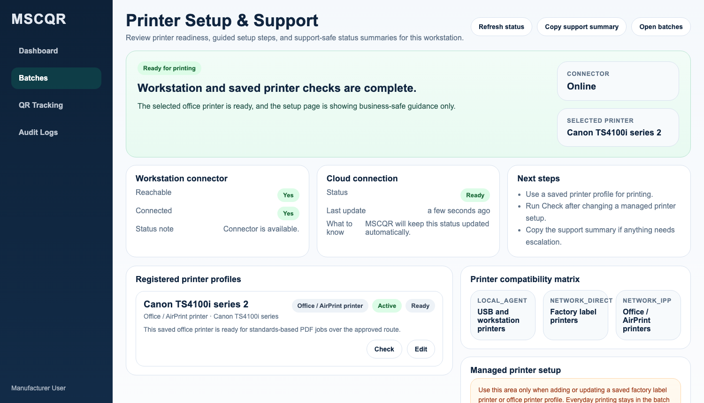
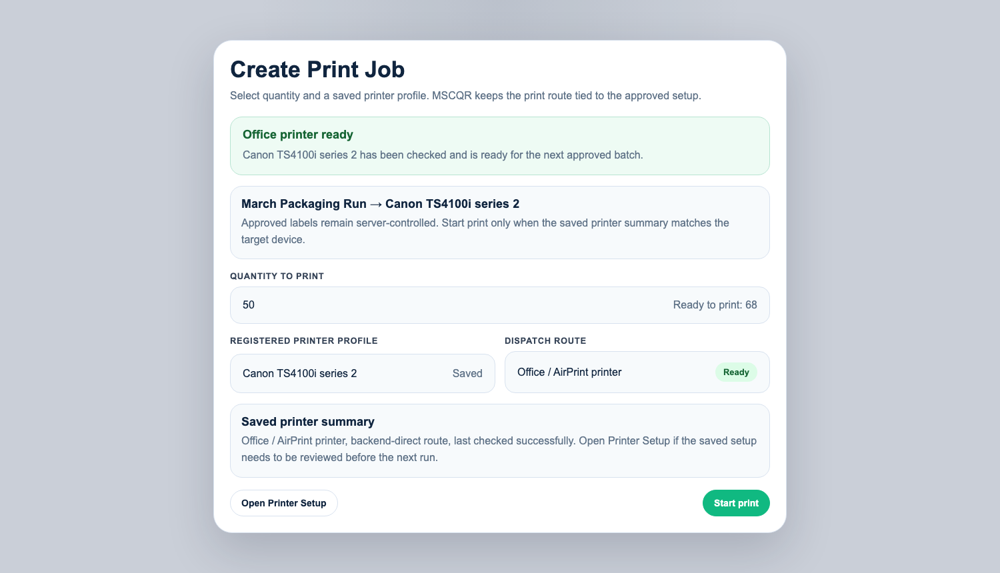
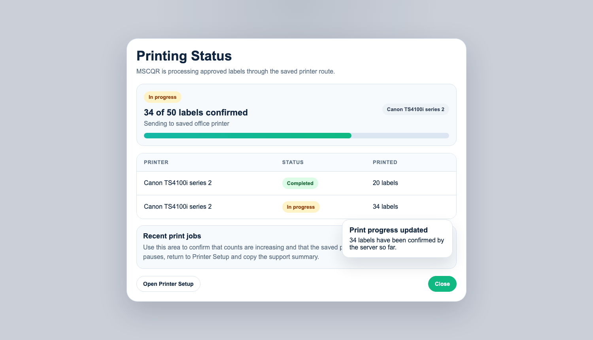

# MSCQR Manufacturer User Manual

Document ID: AQR-SOP-MF-002  
Version: 2.0  
Last Updated: 2026-03-10

## 1. Purpose
This manual is the current operating guide for the Manufacturer role. It is written so a manufacturer user can:
- activate the invited account
- sign in without outside knowledge
- understand every menu item and top control available to the role
- prepare a printer correctly
- create print jobs and complete the direct-print workflow in the right order

## 2. Current Manufacturer Navigation
After sign-in, the left menu shows:
- `Dashboard`
- `Batches`
- `QR Tracking`
- `Audit Logs`

The top-right controls show:
- notification bell
- `Printer` status button
- `Support` issue reporter
- `Help`
- user menu with `Account` and `Log out`

The `Printer Setup & Support` page is not in the left menu. Open it from the `Printer` button or from the print-job dialog.

## 3. Access, Onboarding, and Sign-In
### 3.1 First-time access from an invite
1. Open the invite link from email.
2. On `Activate your account`, enter your name if needed.
3. Enter a password with at least 8 characters.
4. Enter the same password again in `Confirm password`.
5. Select `Activate account`.
6. Wait for the redirect to the dashboard.

### 3.2 Standard sign-in
1. Open the login page.
2. Enter your email address.
3. Enter your password.
4. Select `Sign in`.
5. If MFA is requested, enter the 6-digit code or backup code.
6. Select `Verify MFA`.
7. Confirm the left menu matches the items listed in Section 2.

### 3.3 Forgot password
1. On the login page, select `Forgot password?`
2. Enter your email address.
3. Select `Send reset link`.
4. Open the reset link from email.
5. Enter the new password twice.
6. Select `Update password`.
7. Return to login and sign in again.

## 4. Common User Menu and Top Controls
### 4.1 Notification bell
Use the bell to open live notifications and jump to related records.

### 4.2 Printer button
The `Printer` button shows current printer readiness. Open it before printing to confirm that the workstation printer or registered network printer is ready.

### 4.3 Support issue reporter
Use the top-bar `Support` button to send a problem report to Super Admin with:
- an auto-captured screenshot
- network log counts
- runtime issue counts
- device diagnostics

### 4.4 Help
Select `Help` to open the contextual help page for the screen you are on.

### 4.5 Account and log out
Open the user menu to:
- select `Account` and update your profile or password
- select `Log out` and end the session

## 5. Dashboard
Purpose: confirm your assigned manufacturing scope before printing.

Use `Dashboard` to:
- review your QR totals and batch totals
- review recent activity
- jump to `Batches`, `QR Tracking`, `Verify Page`, or `Account`

Recommended order:
1. Open `Dashboard`.
2. Confirm new assigned work is visible.
3. Open `Batches` when you are ready to print.

## 6. Printer Readiness and Diagnostics
Purpose: make sure the selected printer is valid before you start a print job.

### 6.1 Open the printer panel
1. Select the `Printer` button in the top bar.
2. Review whether the current state says the printer is ready, needs attention, or is blocked.
3. If the state is not ready, use `Refresh status`.

### 6.2 For workstation-managed printers
Check these items in order:
1. The MSCQR Workstation Connector is installed once on the workstation and auto-starting at login.
2. The operating system already sees the printer.
3. The panel shows at least one discovered printer.
4. Select the active workstation printer if needed.
5. Use `Switch workstation printer` when you need another device.
6. Use `Open Printer Setup` if the workstation printer needs setup or alignment changes.

### 6.3 For network-direct printers
1. Confirm the correct registered printer profile is selected.
2. Confirm the printer was saved as a factory label printer and checked successfully.
3. If the profile shows `Needs validation`, `Offline`, or `Blocked`, open `Printer Setup` and correct the profile before printing.

### 6.4 For network IPP printers
1. Confirm the selected profile is an office / AirPrint printer.
2. Confirm the profile has already been checked successfully.
3. Use `Backend direct` only when the MSCQR backend can safely reach the printer.
4. Use `Site gateway` when the printer remains inside a private manufacturer LAN and should not be exposed inbound.
5. If the profile shows `Offline`, `Blocked`, or `Gateway offline`, open `Printer Setup` and re-run the check before printing.

## 7. Batches
Purpose: create controlled print jobs for the batches assigned to your manufacturer account.

### 7.1 Review assigned work
1. Open `Batches`.
2. Use search if needed.
3. Use the printed filter to switch between `All batches`, `Printed`, and `Not printed`.
4. Review the batch row for:
   batch name, code range, available inventory, printed count, redeemed count, and assigned manufacturer.

### 7.2 Create a print job and start dispatch
1. In `Batches`, select `Create Print Job` for the batch you need.
2. Read the printer status panel at the top of the dialog.
3. Enter `Quantity to print`.
4. In `Registered printer profile`, select the correct printer profile.
5. Confirm the saved printer summary shown by MSCQR.
6. If the profile is a workstation printer, confirm the active workstation printer is correct.
7. If the profile is a factory label printer or office / AirPrint printer, continue only when the profile status is `READY`.
8. Select `Start print`.

Current system behavior:
- secure direct-print is used
- browser print fallback is disabled
- server-approved payloads are dispatched only through the selected printer path
- the old ZIP print-pack flow is not the current operating method

### 7.3 After dispatch starts
1. Watch the print progress dialog.
2. Wait for printed counts to increase.
3. When the system confirms completion, the progress dialog closes automatically.
4. If dispatch fails, read the error shown in the dialog before retrying.
5. Return to the batch dialog or batch list and confirm the printed status changed.

### 7.4 Open printer setup from the print-job dialog
If the printer is not ready:
1. Select `Open Printer Setup` from the dialog.
2. Validate the registered profile or workstation printer.
3. Return to `Batches`.
4. Start the print job again only after readiness is green or clearly valid.

## 8. QR Tracking
Purpose: review scan outcomes for the batches already printed in your scope.

### 8.1 Filter tracking results
1. Open `QR Tracking`.
2. Enter one or more filters:
   QR code, batch ID or name, status, first-scan filter, and date range.
3. Select `Apply filters`.
4. Review blocked events, first scans, and scan log history.

Use this page when you need to confirm whether printed labels are being verified normally.

## 9. Audit Logs
Purpose: review the audit history for print and verification activity in your scope.

### 9.1 Review log events
1. Open `Audit Logs`.
2. Leave the page in `LIVE` mode if you want realtime updates.
3. Search or filter by action.
4. Expand details when you need entity IDs, IP information, or full event fields.

Use this page to confirm:
- print job creation
- direct-print events
- verification outcomes
- investigation-related actions visible to your scope

## 10. Correct Working Order for Printing
Use this order for every production run:
1. Sign in.
2. Open the `Printer` button and confirm readiness.
3. Open `Batches`.
4. Confirm the correct assigned batch and available quantity.
5. Create the print job.
6. Confirm dispatch completed.
7. Re-check the batch list for updated printed status.
8. Use `QR Tracking` or `Audit Logs` only when you need to investigate post-print behavior.

## 11. Troubleshooting
- If `Create Print Job` is disabled, confirm the batch still has quantity ready to print.
- If the printer panel shows no connection, open `Printer Setup` and verify the workstation connector or saved printer profile first.
- If the wrong workstation printer is selected, switch the active printer before starting the job.
- If dispatch fails, do not keep retrying blindly. Re-open readiness, validate the profile, and then start a fresh attempt.
- If the app errors while you are working, use the top-bar `Support` button so diagnostics and a screenshot are attached automatically.

## 12. Mandatory Compliance Statements
### 12.1 UK GDPR and Data Protection
MSCQR processes personal data in accordance with UK GDPR and the Data Protection Act 2018. Data protection queries must be directed to administration@mscqr.com.

### 12.2 Security and Access Control
Access control is role-based for Super Admin, Licensee Admin, and Manufacturer users. Communication is encrypted over HTTPS, passwords are handled using secure controls, and critical actions are recorded in audit logs.

### 12.3 Incident Response and Fraud Reporting
The controlled process is: report intake -> review -> containment -> documentation -> resolution.

### 12.4 QR Code Usage and Non-Duplication
All QR codes are unique, traceable, and single-use where applicable. QR codes must not be duplicated, altered, or reused.

### 12.5 Audit Logging Notice
Administrative actions, QR allocations, fraud reports, and login attempts are logged and retained for 180 days.

### 12.6 Acceptable Use
Unauthorized access, reverse engineering, misuse of fraud reporting, or interference with system security is prohibited.

### 12.7 Hosting and Disclaimer
The platform is hosted via AWS Lightsail and Amazon RDS with reasonable security controls and is provided on a best-effort basis.
