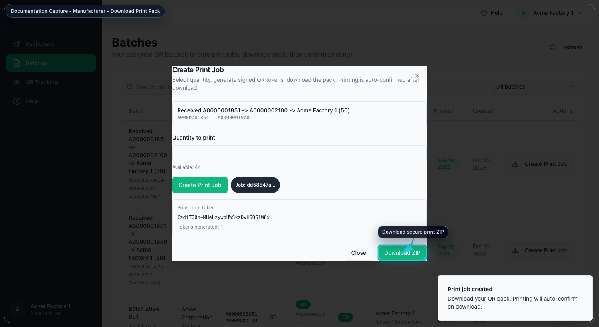

# AuthenticQR Manufacturer Procedure Guide

Document ID: AQR-SOP-MF-001  
Version: 1.0  
Last Updated: 2026-02-16

## 1. Purpose
Define the controlled operating procedure for Manufacturer users performing print workflows.

## 2. Scope
This procedure applies to manufacturer accounts with assigned batches.

## 3. Preconditions
- Active manufacturer account.
- Assigned batch with available quantity.
- Secure environment for ZIP print pack handling.

## 4. Procedure
### 4.1 Sign in
1. Open the login page.
2. Enter manufacturer credentials.
3. Confirm access to assigned `Batches`.

### 4.2 Create print job
1. Open `Batches`.
2. Select assigned batch.
3. Select `Create Print Job`.
4. Enter quantity and confirm.

### 4.3 Download print pack
1. Select `Download ZIP`.
2. Save ZIP in controlled storage.
3. Execute print process per plant controls.

### 4.4 Validate print status
1. Return to `Batches`.
2. Confirm status reflects printed output.

## 5. Acceptance Criteria
- ZIP download completes successfully.
- Printed status updates in system records.
- Trace events reflect print workflow.

## 6. Nonconformance and Escalation
- If token expires or download fails, create a new print job for remaining quantity.
- If status does not update, refresh once and verify connectivity.
- Escalate with batch ID, job ID, and timestamp when unresolved.

## 7. Mandatory Compliance Statements
### 7.1 UK GDPR & Data Protection notice
`{{APP_NAME}}` processes personal data in accordance with UK GDPR and the Data Protection Act 2018. Data protection queries must be directed to `{{DPO_EMAIL}}` or `{{SUPER_ADMIN_EMAIL}}`.

### 7.2 Security & Access Control statement
The platform enforces role-based access control (Super Admin, Licensee, Manufacturer), encrypted HTTPS communication, secure password handling, and audit logging of critical actions.

### 7.3 Incident Response & Fraud Reporting
Controlled process: report intake -> review -> containment -> documentation -> resolution.

### 7.4 QR Code Usage & Non-Duplication policy
All QR codes are unique, traceable, and single-use where applicable. QR codes must not be duplicated, altered, or reused.

### 7.5 Audit Logging notice
Administrative actions, QR allocations, fraud reports, and login attempts are logged and retained for `{{RETENTION_DAYS}}` days.

### 7.6 Acceptable Use clause
Unauthorized access, reverse engineering, misuse of fraud reporting, or interference with system security is prohibited.

### 7.7 Hosting & Disclaimer statement
The platform is hosted via `{{HOSTING_PROVIDER}}` with reasonable security controls and is provided on a best-effort basis.
