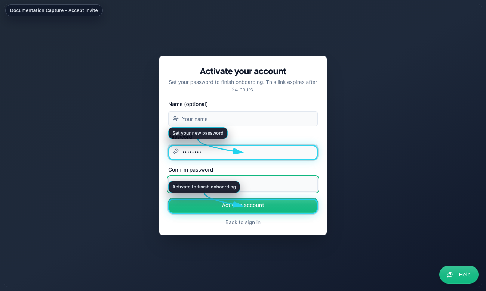
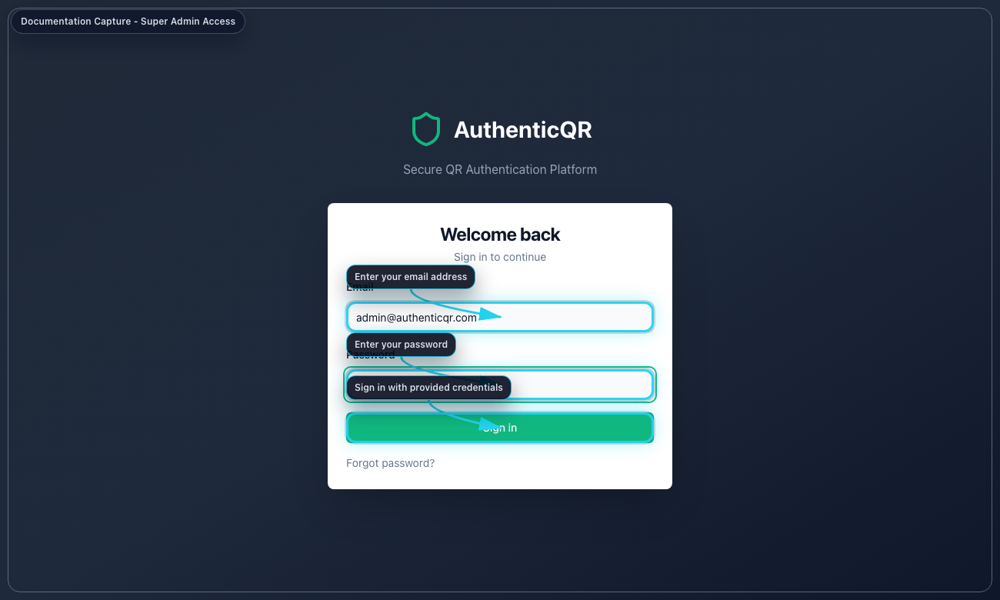
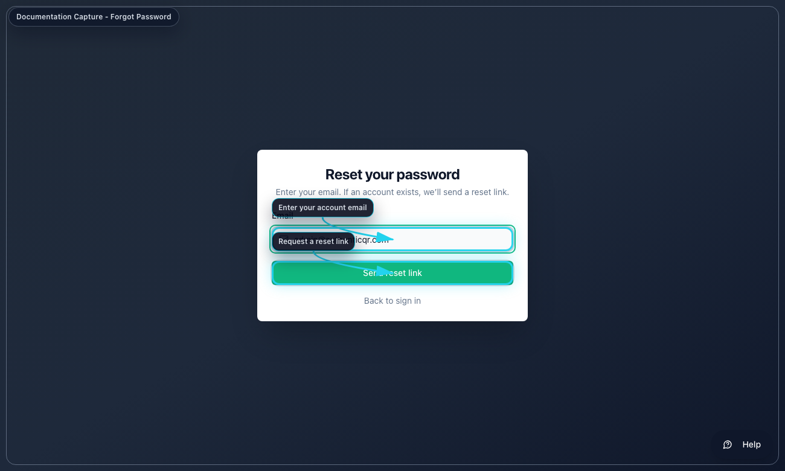
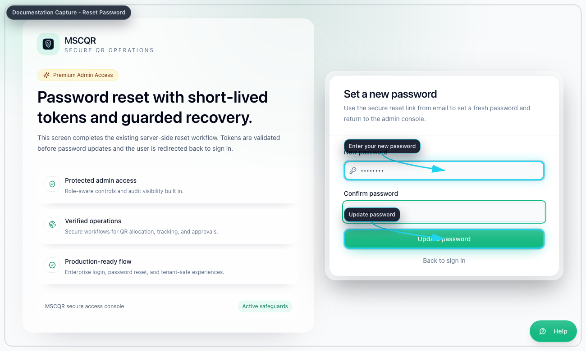
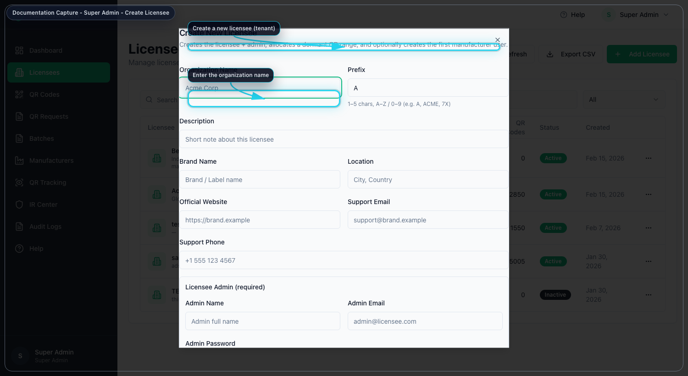
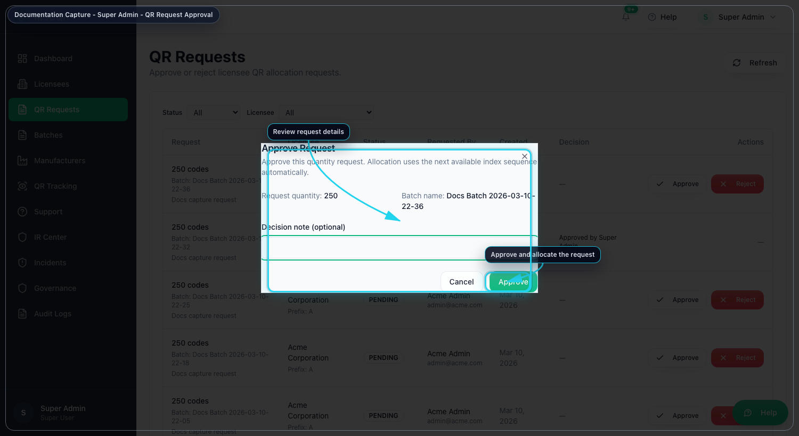
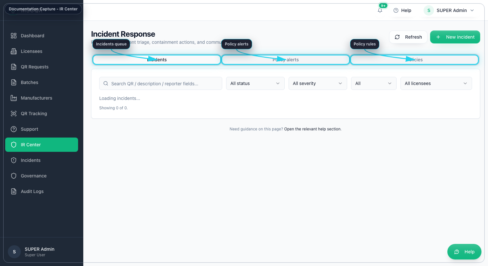
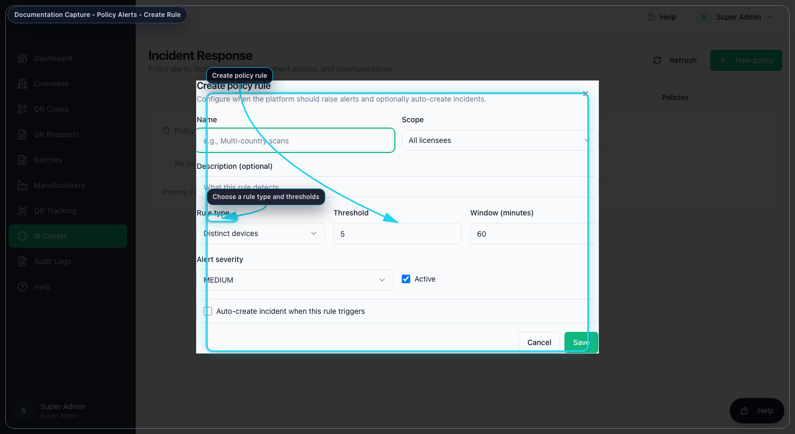
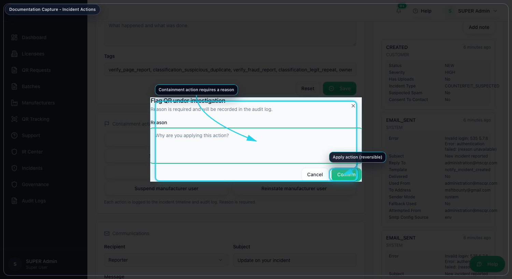
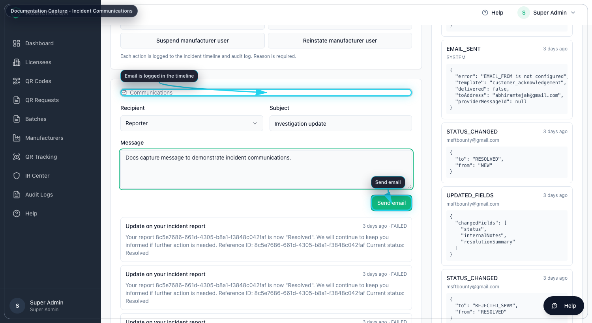

# MSCQR Super Admin User Manual

Document ID: AQR-SOP-SA-002  
Version: 2.0  
Last Updated: 2026-03-10

## 1. Purpose
This manual is the current operating guide for the Super Admin role. It is written so a Super Admin can:
- activate an account from an invite
- sign in without relying on outside knowledge
- understand every item visible in the Super Admin menu
- complete the current platform tasks in the correct order

## 2. Current Super Admin Navigation
After sign-in, the left menu shows these items:
- `Dashboard`
- `Licensees`
- `QR Requests`
- `Batches`
- `Manufacturers`
- `QR Tracking`
- `Support`
- `IR Center`
- `Incidents`
- `Governance`
- `Audit Logs`

The top-right controls show:
- notification bell
- `Help`
- user menu with `Account` and `Log out`

If any of the items above are missing, confirm you are signed in as a Super Admin account.

## 3. Access, Onboarding, and Sign-In
### 3.1 First-time access from an invite
1. Open the invite link sent by email.
2. On `Activate your account`, enter your name if you want it stored on the account.
3. Enter a password with at least 8 characters.
4. Re-enter the same password in `Confirm password`.
5. Select `Activate account`.
6. Wait for the system to redirect you to the dashboard.

### 3.2 Standard sign-in
1. Open the system login page.
2. Enter your email address.
3. Enter your password.
4. Select `Sign in`.
5. If the system asks for MFA, enter the 6-digit code or backup code.
6. Select `Verify MFA`.
7. Confirm the left menu contains all Super Admin items listed in Section 2.

### 3.3 Forgot password
1. On the login page, select `Forgot password?`
2. Enter the account email address.
3. Select `Send reset link`.
4. Open the email link.
5. Enter the new password twice.
6. Select `Update password`.
7. Return to the login page and sign in.

## 4. Common User Menu and Page Controls
### 4.1 Notification bell
Use the bell to open live notifications. Select a notification to open the related page.

### 4.2 Help
Select `Help` to open the contextual help page for the current screen.

### 4.3 Account
Open the user menu and select `Account` to:
1. update your display name
2. update your email address
3. change your password with your current password

### 4.4 Log out
Open the user menu and select `Log out` to end the current session.

## 5. Dashboard
Purpose: read platform-wide totals and move quickly to the next operational page.

Use `Dashboard` to:
- review live QR totals and batch totals
- monitor recent audit activity
- jump to `Licensees`, `QR Requests`, `QR Tracking`, or `Audit Logs`
- refresh the page when live updates are not enough

Recommended order:
1. Open `Dashboard`.
2. Review summary cards and QR status totals.
3. Check recent activity for unexpected approvals, prints, or investigations.
4. Use the quick actions to move to the page you need next.

## 6. Licensees
Purpose: create and manage tenant organizations, their admin access, and QR top-ups.

### 6.1 Create a new licensee
1. Open `Licensees`.
2. Select `Add Licensee`.
3. Enter the organization details:
   `Organization Name`, `Prefix`, optional description, brand, location, website, support email, support phone.
4. Enter the required `Licensee Admin` name and email.
5. Enter the first QR range using `Range Start` and `Range End`.
6. If you want the system to create the first manufacturer immediately, enable `Create Manufacturer now` and enter the manufacturer details.
7. Select `Create`.
8. If the invite email does not send, copy the generated invite link and share it securely.

### 6.2 Allocate more QR inventory to an existing licensee
1. In `Licensees`, open the action menu for the target licensee.
2. Select `Allocate QR Range`.
3. Review `Last allocated range` and `Suggested next start`.
4. Choose `By quantity` if you only know how many codes are needed.
5. Choose `By range` only when you need a specific numeric start and end.
6. Enter an optional `Received Batch Name`.
7. Select `Allocate QR`.

### 6.3 Create another user under a licensee
1. In `Licensees`, open the action menu.
2. Select `Create User`.
3. Enter the person’s name and email.
4. Select the role:
   `Manufacturer user` or `Licensee user`.
5. Select `Send invite`.
6. Manufacturer invites include the password activation link and the MSCQR Connector download page for Mac and Windows.

### 6.4 Edit or control an existing licensee
From the licensee action menu you can:
- `Edit` to update organization details and status
- `Resend admin invite`
- `Copy invite link`
- `Deactivate` or `Activate`
- `Hard Delete`

Use `Hard Delete` only when you are certain the tenant has no linked data that must be preserved.

## 7. QR Requests
Purpose: approve or reject licensee requests for new QR inventory.

### 7.1 Review and decide a request
1. Open `QR Requests`.
2. Filter by `Status` and, if needed, by `Licensee`.
3. Open the row you want to review.
4. Check quantity, requested batch name, notes, and requesting user.
5. Select `Approve` if the request should become inventory.
6. Add a decision note if needed.
7. Confirm the approval.

Approval result:
- the next available QR sequence is allocated automatically
- the approved request becomes a received source batch for that licensee

### 7.2 Reject a request
1. Open the request row.
2. Select `Reject`.
3. Add a decision note if needed.
4. Confirm the rejection.

## 8. Batches
Purpose: monitor received source batches and control allocation structure.

### 8.1 Open the source batch workspace
1. Open `Batches`.
2. Search or filter to the source batch you need.
3. Select `Open`.
4. Use the workspace tabs:
   `Overview`, `Operations`, `Audit`.

### 8.2 Review the batch in `Overview`
Use `Overview` to confirm:
- original QR quantity
- remaining unassigned quantity
- assigned quantity by manufacturer
- printed, redeemed, and blocked counts
- source batch identifiers and dates

### 8.3 Allocate quantity to a manufacturer in `Operations`
1. Open the source batch workspace.
2. Open `Operations`.
3. In `Allocate to manufacturer`, choose the manufacturer.
4. Enter `Quantity to allocate`.
5. Check the remaining balance shown by the system.
6. Select `Allocate quantity`.

### 8.4 Use the other `Operations` actions
Inside the workspace you can also:
- `Rename source batch`
- `View allocation structure`
- `Download audit package`
- `Delete source batch` if traceability rules allow it

## 9. Manufacturers
Purpose: review manufacturer users across licensees and jump into their workload.

### 9.1 Review manufacturer workload
1. Open `Manufacturers`.
2. Use search and the licensee filter if needed.
3. Review:
   assigned batches, pending print, printed batches, last assignment time, and active status.
4. Use `Open manufacturer batches` to jump directly into that manufacturer’s batch scope.

### 9.2 View a manufacturer detail panel
1. Select `View details`.
2. Review the manufacturer profile, activity totals, and recent assigned batches.
3. Use `Open manufacturer batches` from the detail dialog if you need batch-level review.

### 9.3 Restore or deactivate a manufacturer
1. Open the manufacturer action menu.
2. Select `Deactivate` or `Restore`.
3. Confirm the action.

## 10. QR Tracking
Purpose: inspect scan activity, lifecycle state, and blocked events.

### 10.1 Filter tracking results
1. Open `QR Tracking`.
2. Enter one or more filters:
   code, batch ID or batch name, status, first-scan filter, date range, and licensee scope.
3. Select `Apply filters`.
4. Review the summary cards and the scan log table.

### 10.2 Investigate allocation context
1. Find the relevant batch in the summary table.
2. Select `Open allocation map`.
3. Use the map to understand how quantity moved from the source batch to allocated manufacturer batches.

## 11. Support
Purpose: manage support tickets and in-app issue reports.

### 11.1 Work the support queue
1. Open `Support`.
2. Filter by search, status, or priority.
3. Select `Apply`.
4. Open the target ticket.
5. Update status and assignee.
6. Select `Save workflow update`.
7. Add a message in the timeline and send it.

### 11.2 Respond to incoming user issue reports
1. In `Support`, review `Incoming User Issue Reports`.
2. Open the screenshot if needed.
3. Enter your response in the reply box.
4. Select `Send response`.

## 12. IR Center
Purpose: manage policy-driven incident response from one console.

The `IR Center` has three tabs:
- `Incidents`
- `Policy alerts`
- `Policies`

### 12.1 Create a manual IR incident
1. Open `IR Center`.
2. Make sure the `Incidents` tab is selected.
3. Select `New incident`.
4. Enter the QR code value.
5. Select incident type, severity, and priority.
6. Enter a short investigator description.
7. Select `Create incident`.
8. Open the created incident detail page if prompted.

### 12.2 Review policy alerts
1. Open the `Policy alerts` tab.
2. Filter by acknowledgement state, severity, alert type, or licensee.
3. Open the linked incident when one exists.
4. Acknowledge or unacknowledge the alert as required.

### 12.3 Create or edit a policy
1. Open the `Policies` tab.
2. Select `New policy` or open an existing rule to edit.
3. Enter the policy name and rule type.
4. Set threshold and window.
5. Set alert severity.
6. Decide whether the rule should auto-create an incident.
7. If auto-create is enabled, set incident severity and priority.
8. Save the policy.

## 13. Incidents
Purpose: manage customer-reported or support-linked incident cases.

### 13.1 Triage an incident
1. Open `Incidents`.
2. Apply the filters you need.
3. Select an incident from the list.
4. Review the case reference, QR, contact details, workflow stage, support ticket reference, and SLA.
5. Update status, assignee, severity, tags, or date fields as needed.
6. Select `Save updates`.

### 13.2 Communicate and document
Inside the same incident detail panel you can:
- send a customer update
- `Add note`
- use quick actions such as `Resolve` or `Reject as spam`

## 14. Governance
Purpose: control tenant policy, retention, compliance evidence, and telemetry.

### 14.1 Select the tenant scope first
1. Open `Governance`.
2. If the tenant selector is visible, choose the licensee before changing anything else.

### 14.2 Manage verification feature flags
Use the feature flag switches to enable or disable:
- timeline card
- dynamic risk cards
- ownership claim
- fraud report
- mobile camera assist

### 14.3 Run evidence retention safely
1. Review or change `Retention days`.
2. Review `Legal hold tags`.
3. Decide whether `Purge enabled` should be on.
4. Decide whether `Export before purge` should be on.
5. Select `Save policy`.
6. Select `Preview run` first.
7. Only after reviewing the preview counts, select `Apply run`.

### 14.4 Generate compliance evidence
Use the rest of the page to:
- generate the automated compliance report
- load route transition telemetry
- generate or download signed compliance packs
- export an incident evidence audit bundle by incident ID

## 15. Audit Logs
Purpose: review live audit events and the fraud report queue.

### 15.1 Audit event stream
1. Open `Audit Logs`.
2. Leave the page in `LIVE` mode when you want realtime updates.
3. Use `Pause` when you want a fixed review state.
4. Search or filter by action or licensee.
5. Expand a row to inspect entity ID, licensee, IP, and detail keys.

### 15.2 Fraud report queue
For Super Admin, the page also shows `Fraud Report Queue`.

To process a fraud report:
1. Open `Audit Logs`.
2. Review the fraud case details.
3. Select `Mark reviewed`, `Resolve`, or `Dismiss`.
4. Choose the new status.
5. Add an investigation message if required.
6. Decide whether the customer should be notified.
7. Select `Apply action`.

## 16. Incident Detail from IR Center
When you open an incident from `IR Center`, the detail page lets you:
- update status, assignee, severity, and priority
- apply containment actions with a required reason
- send communications
- upload and download evidence
- add timeline notes
- review linked policy alerts

## 17. Troubleshooting
- If the account cannot sign in, confirm the invite link or reset link was used before it expired.
- If MFA appears unexpectedly, complete the code entry step before retrying the password.
- If a QR request approval fails with a busy message, refresh the page and retry once.
- If a source batch cannot be deleted, assume linked allocations or trace history must be preserved.
- If a support or incident email fails, save the workflow changes first and then retry the communication.
- If governance changes fail, confirm the tenant scope is selected before editing flags or retention.

## 18. Mandatory Compliance Statements
### 18.1 UK GDPR and Data Protection
MSCQR processes personal data in accordance with UK GDPR and the Data Protection Act 2018. Data protection queries must be directed to administration@mscqr.com.

### 18.2 Security and Access Control
Access control is role-based for Super Admin, Licensee Admin, and Manufacturer users. Communication is encrypted over HTTPS, passwords are handled using secure controls, and critical actions are recorded in audit logs.

### 18.3 Incident Response and Fraud Reporting
The controlled process is: report intake -> review -> containment -> documentation -> resolution.

### 18.4 QR Code Usage and Non-Duplication
All QR codes are unique, traceable, and single-use where applicable. QR codes must not be duplicated, altered, or reused.

### 18.5 Audit Logging Notice
Administrative actions, QR allocations, fraud reports, and login attempts are logged and retained for 180 days.

### 18.6 Acceptable Use
Unauthorized access, reverse engineering, misuse of fraud reporting, or interference with system security is prohibited.

### 18.7 Hosting and Disclaimer
The platform is hosted via AWS Lightsail and Amazon RDS with reasonable security controls and is provided on a best-effort basis.
