# AuthenticQR User Manual

Version: 1.0  
Audience: Super Admin, Licensee Admin, Manufacturer, Customer  
Last Updated: 2026-02-15

## 1. Purpose
This manual defines the standard operating workflow for managing QR code allocations, manufacturer assignments, secure printing, and product verification in AuthenticQR.

The platform is designed for anti-counterfeit control:
- Licensee receives dormant QR inventory.
- Licensee assigns quantities to manufacturers.
- Manufacturer prints under server-controlled lock.
- Customer scan validates authenticity and classifies risk as first scan, legit repeat, or possible duplicate.

## 1.1 In-app Help Pages

Use the in-app documentation for screenshot-based guidance:
- `/help`
- `/help/getting-access`
- `/help/setting-password`
- `/help/super-admin`
- `/help/licensee-admin`
- `/help/manufacturer`
- `/help/customer`

Screenshot files are served from `/public/docs/`. Missing files show placeholders in the help pages.

## 1.2 Getting Access (by user type)

If you are unsure which role you have, ask the person who created your account.

### Super Admin
- Created by: an existing Super Admin (or during initial platform setup).
- Login: `/login` with the email/password provided.
- If you are locked out: contact another Super Admin (there is no self-serve reset today).

### Licensee/Admin (brand/company)
- Created by: Super Admin.
- Credentials are provided out-of-band (there is no invite-acceptance flow today).
- Login: `/login`.

### Manufacturer (factory user)
- Created by: Super Admin or Licensee/Admin.
- Login: `/login` with credentials provided by your admin.

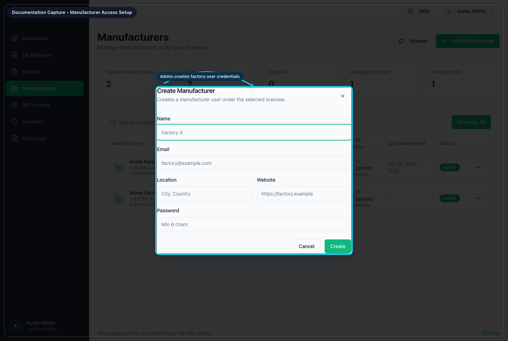

### Customer (scanner / verification page)
- No admin-created account is required to verify.
- Open the QR link printed on the product (for example `/verify/<code>` or `/scan?t=...`).
- Optional: sign in (Google or Email OTP) to claim ownership and improve protection.

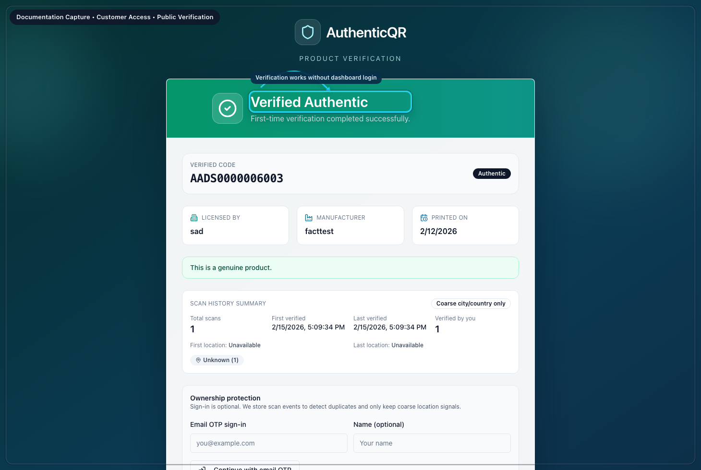

## 1.3 Setting Your Password / Signing In (by user type)

### Super Admin, Licensee/Admin, Manufacturer (dashboard users)

Change password:
1. Sign in.
2. Open `Account` (top-right user menu).
3. Open `Security`.
4. Set a new password.

Reset password:
- Current behavior: there is no “Forgot password” email flow in-app.
- Contact your admin (or another Super Admin) to reset access.

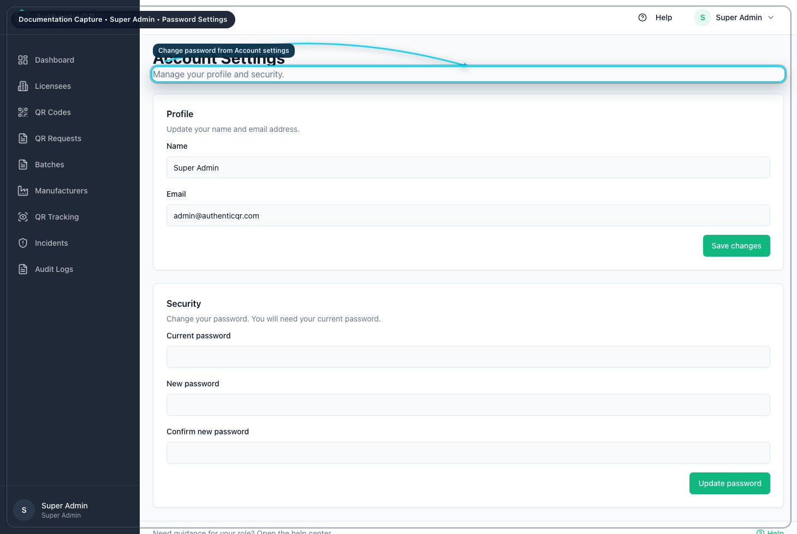

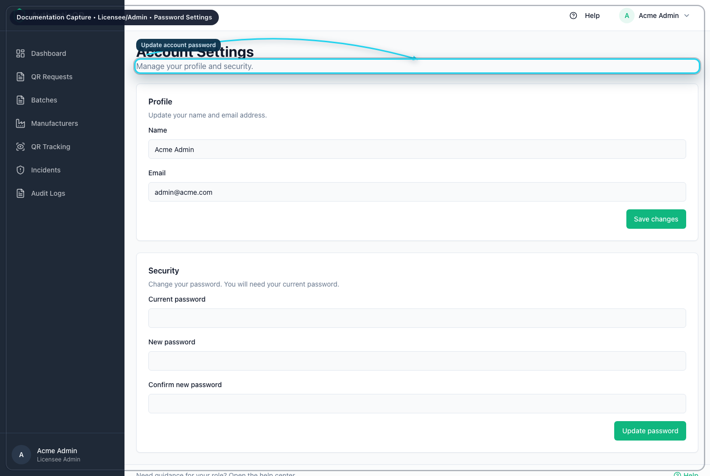

### Customer (verification page)
Customers do not set a password.
- Email OTP: request a one-time code and enter it to sign in.
- Google: if enabled by the brand, use Google sign-in.

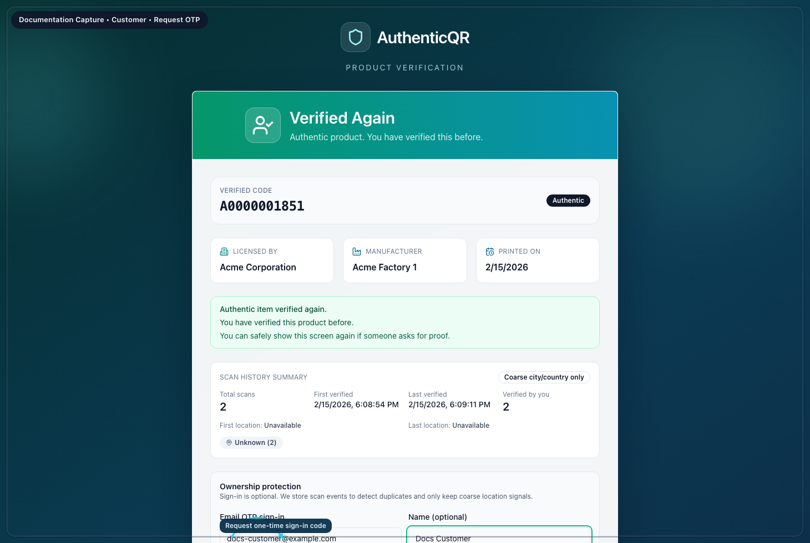

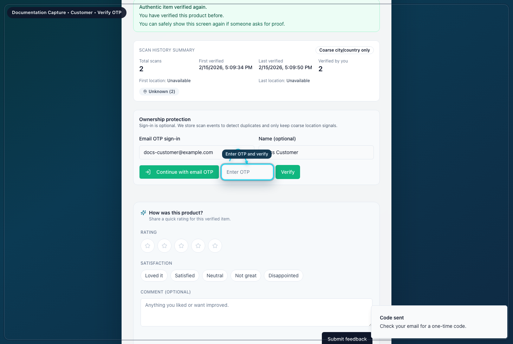

## 2. Role Access

### Super Admin
Can:
- Create and manage licensees.
- Allocate QR inventory ranges to licensee pools.
- Approve or reject licensee QR requests.
- View cross-tenant incidents, QR tracking, and audit logs.

Cannot:
- There is no self-service password reset flow today (reset is handled by an existing Super Admin).

### Licensee Admin
Can:
- Manage manufacturers under the same licensee.
- Request additional QR inventory by quantity.
- Assign received batch quantities to manufacturers.
- Review own audit logs and manufacturer activity under same licensee.

Cannot:
- Access other licensees.
- Override Super Admin controls.

### Manufacturer
Can:
- View only assigned batches.
- Create print jobs by quantity.
- Download print packs once per print job.
- Rely on auto-confirm print state after download.

Cannot:
- Request QR inventory directly.
- Access licensee-wide admin functions.

### Customer (Public Verify User)
Can:
- Scan a QR by opening verify URL or signed token URL.
- Verify authenticity status with product and brand details.
- Re-scan the same genuine product and get `Verified Again` (legit repeat), not automatic fraud messaging.
- Optionally continue as guest or sign in (Google or email OTP).
- Claim product ownership after sign-in to improve duplicate protection.
- View scan history summary: total scans, first/last verification time, and coarse location hints.
- Report suspected counterfeit/duplicate with optional photos or proof of purchase.
- Contact support from the verify page using brand support details.

Cannot:
- Access admin dashboards, inventory tools, or tenant data.
- View precise GPS traces (only coarse city/country style location context is shown).
- Override fraud classification or unblock codes.

## 3. Core Data Rules

1. QR inventory from Super Admin is stored as `DORMANT`.
2. Assignment is quantity-based and always allocated from the next available codes.
3. Overlapping ranges are prevented by server-side transaction locking.
4. Manufacturer printing is one-time controlled by print job token flow.
5. First valid customer scan is `FIRST_SCAN`; later scans are classified as `LEGIT_REPEAT` or `SUSPICIOUS_DUPLICATE`.

## 4. Super Admin Guide

### 4.1 Login
1. Open `/login`.
2. Sign in with Super Admin credentials.
3. After sign-in, you land on the dashboard.

### 4.2 Create Licensee + First Admin User
Path: `Licensees`

Steps:
1. Click `Add Licensee`.
2. Fill licensee details (name, prefix, brand/support fields).
3. Fill the first Licensee Admin user (name, email, password).
4. Create.

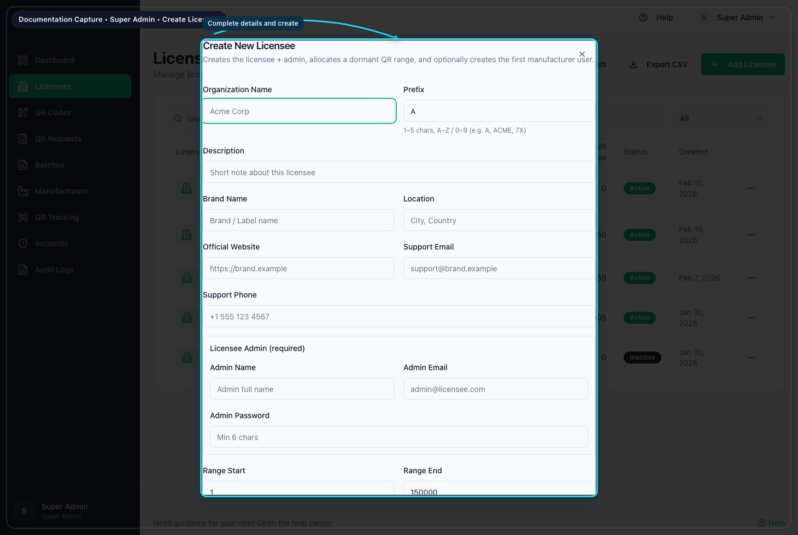

### 4.3 Allocate QR Range to a Licensee
Path: `Licensees` → row `Actions` → `Allocate QR Range`

Notes:
- This adds new QR codes to the licensee pool in `DORMANT` state.
- Ranges are unique; allocate carefully.

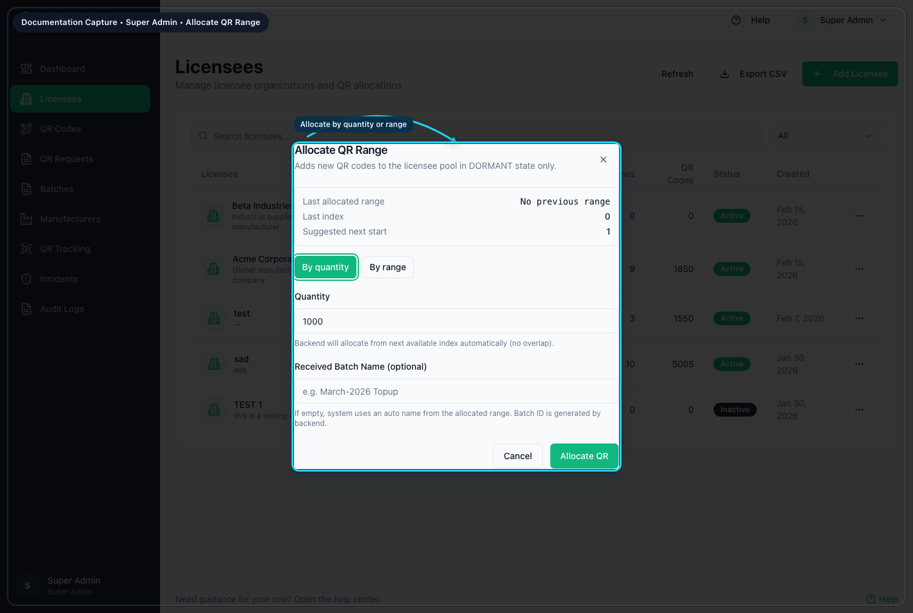

### 4.4 Approve QR Requests
Path: `QR Requests`

Steps:
1. Filter `Status` to `Pending`.
2. Click `Approve` for a request.
3. Confirm approval.

### 4.5 Monitor Incidents and Risk Signals
Paths:
- `Incidents` (customer fraud reports)
- `QR Tracking` (scan activity and policy alerts)

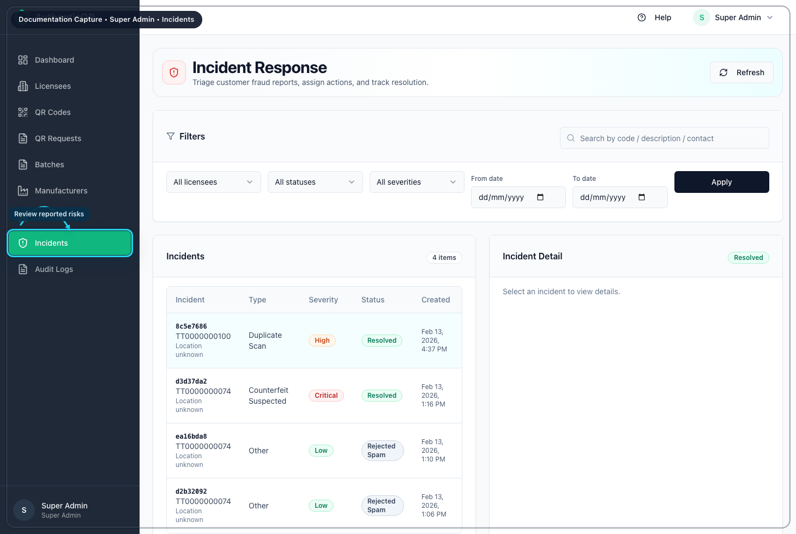

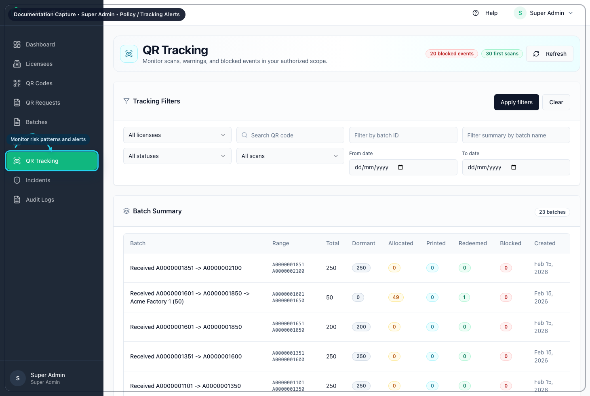

## 5. Licensee Admin Guide

### 5.1 Login
1. Open the web app URL.
2. Sign in with licensee admin email and password.
3. Confirm left navigation includes `QR Requests`, `Batches`, `Manufacturers`, `Audit Logs`.

### 5.2 Manufacturers
Path: `Manufacturers`

Actions:
1. Click `Add Manufacturer`.
2. Fill `Name`, `Email`, `Password`, optional `Location`, optional `Website`.
3. Submit.
4. Use search to filter by name/email.
5. Toggle active/all status as needed.

Expected behavior:
- Only manufacturers linked to your licensee are listed.
- If the primary manufacturer endpoint is unavailable, app falls back to user list endpoint automatically.

### 5.3 Request New QR Inventory
Path: `QR Requests`

Actions:
1. Enter `Quantity`.
2. Optionally add a request note.
3. Click `Submit Request`.

Approval flow:
1. Super Admin approves request.
2. Backend allocates next available sequence automatically.
3. New allocation appears as a received batch in your `Batches` page.

Notes:
- Requesting by range is deprecated for licensee workflow.
- Quantity is the only supported request mode.

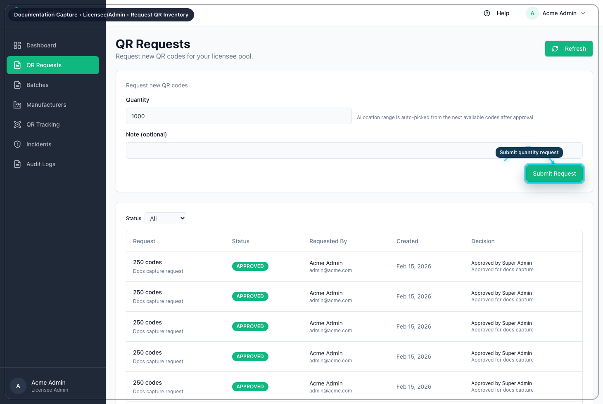

### 5.4 Assign Received Batches to Manufacturer
Path: `Batches`

Actions:
1. Find an unassigned received batch.
2. Open `Assign Manufacturer`.
3. Select manufacturer.
4. Enter quantity.
5. Submit.

Allocation behavior:
- System always uses the next unassigned QR codes in sequence.
- No overlap is allowed.
- Remaining quantity stays available for later assignments.

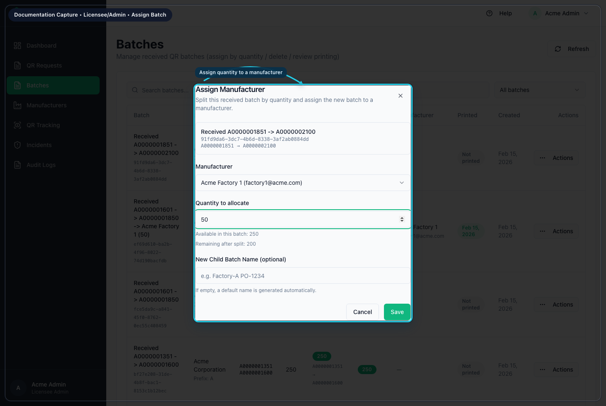

### 5.5 Audit Logs
Path: `Audit Logs`

Scope:
- You see only your licensee activity and your manufacturers’ actions.
- Super Admin-only actions for other licensees are not visible in your scope.

Use audit logs for:
- Allocation tracing.
- Assignment verification.
- Print/download investigation.

### 5.6 Incidents and QR Tracking
Paths:
- `Incidents` (customer fraud reports)
- `QR Tracking` (scan history and risk patterns)

Use this for:
- Reviewing customer reports tied to your licensee.
- Investigating “Possible Duplicate” warnings using scan history and filters.

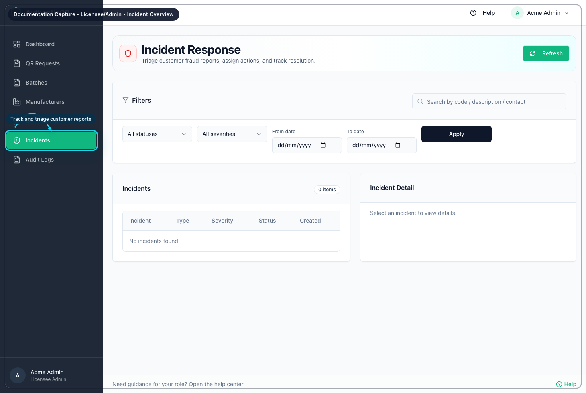

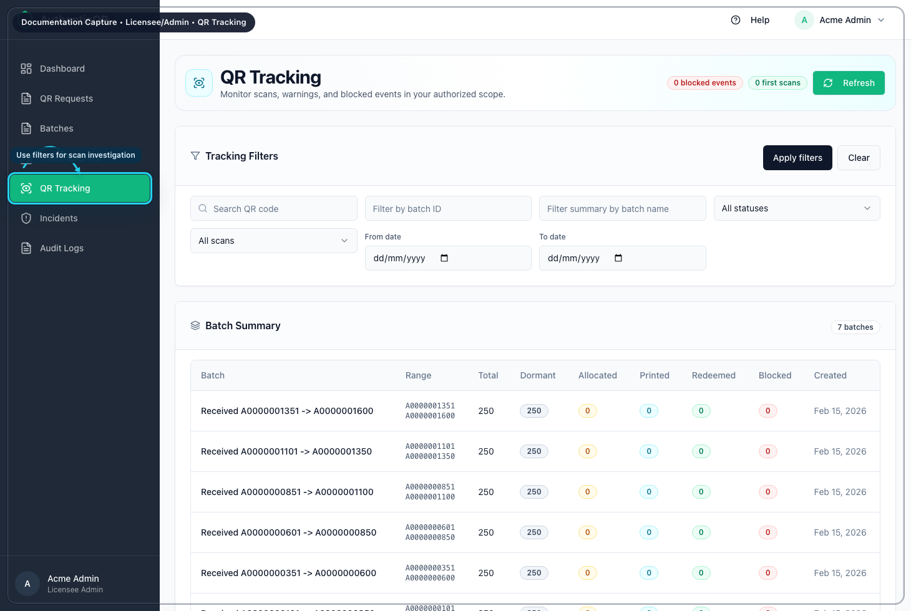

## 6. Manufacturer Guide

### 6.1 Login
1. Open app URL.
2. Sign in with manufacturer credentials.
3. Confirm access to assigned batch operations.

### 6.2 View Assigned Batches
Path: `Batches`

You should see:
- Batches assigned to your manufacturer account only.
- Quantity and print status indicators.

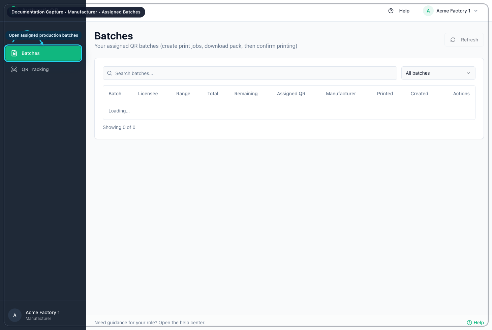

### 6.3 Create Print Job
1. Open target batch.
2. Click `Create Print Job`.
3. Enter quantity to print.
4. Submit.

System behavior:
- Server generates signed tokens for selected QR records.
- Batch reservation follows available unprinted QR count.

### 6.4 Download Print Pack
1. Click `Download ZIP` for created job.
2. Save and print labels.

Security behavior:
- Download is one-time for the same print job token.
- Server auto-confirms print state after successful download.
- Re-download attempt is blocked.

### 6.5 Print Confirmation
Expected:
- Batch/QR statuses update to printed automatically.
- No manual duplicate confirmation required in normal flow.

If status does not update:
1. Refresh page.
2. Check network/API connectivity.
3. Contact Licensee Admin with job ID and timestamp.

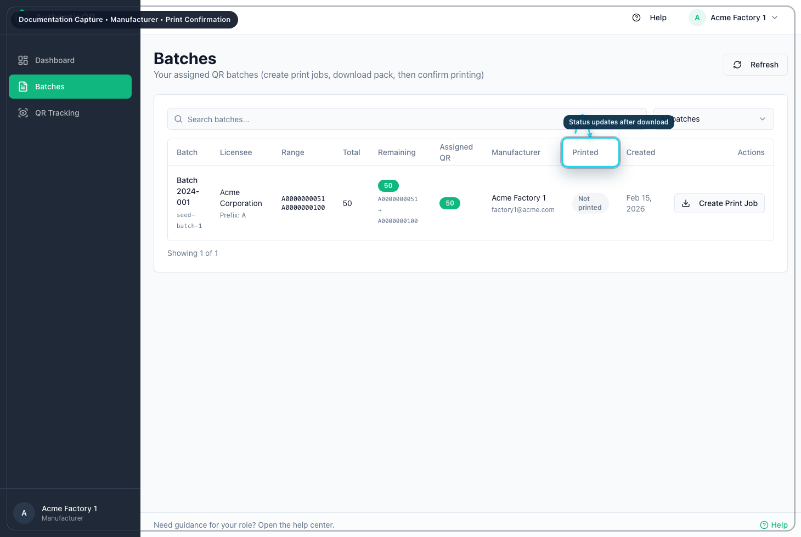

## 7. Customer Guide (Verify Page)

### 7.1 Open Verification
1. Scan QR code with phone camera or open `/verify/<code>` URL.
2. Wait for authenticity and risk checks to complete.

### 7.2 Understand Verification Result

Possible states:
- `Verified Authentic` (`FIRST_SCAN`): first recorded verification of this QR.
- `Verified Again` (`LEGIT_REPEAT`): repeat scan by same customer/account/device pattern.
- `Possible Duplicate` (`SUSPICIOUS_DUPLICATE`): unusual cross-identity/device/location pattern; review carefully.
- `Blocked by Security`: code blocked by policy or fraud controls.
- `Not Ready for Customer Use`: code not printed/activated for customer use.

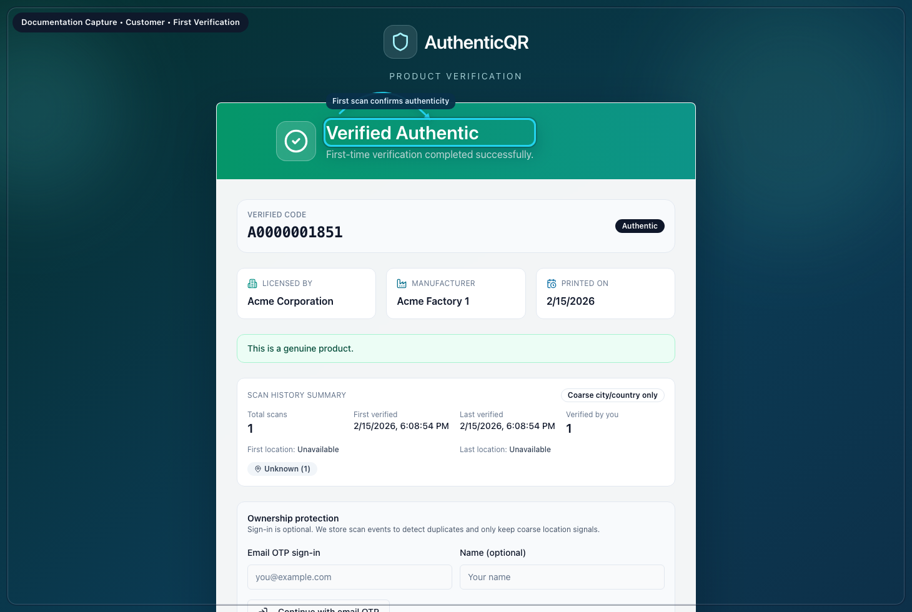

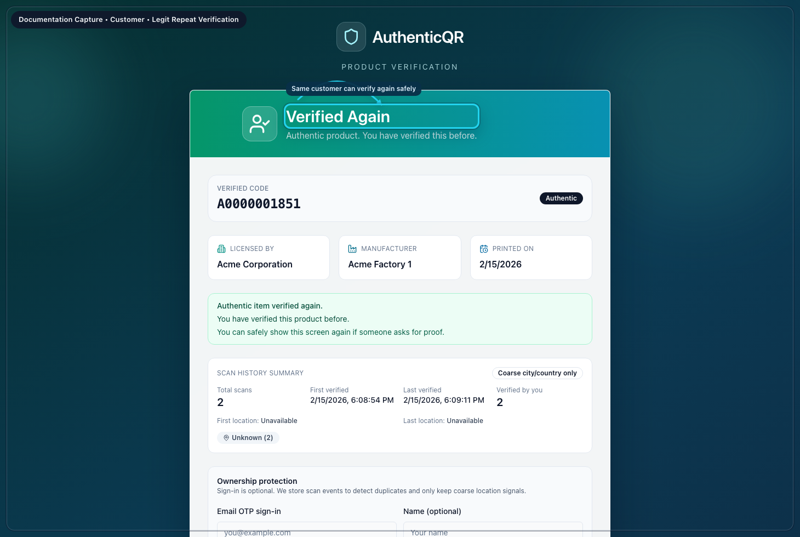

### 7.3 Optional Sign-In for Better Protection
Customers may:
1. Sign in with Google (if configured), or
2. Continue with email OTP.

Benefits:
- Claim product ownership.
- Increase confidence for future repeat scans from same customer.
- Stronger warning when other identities scan an owned product.

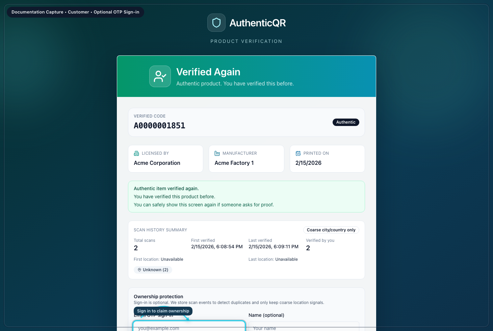

### 7.4 Claim Product Ownership
1. Sign in on verify page.
2. Click `Claim this product`.
3. Ownership is linked to customer account and stored with claim timestamp.

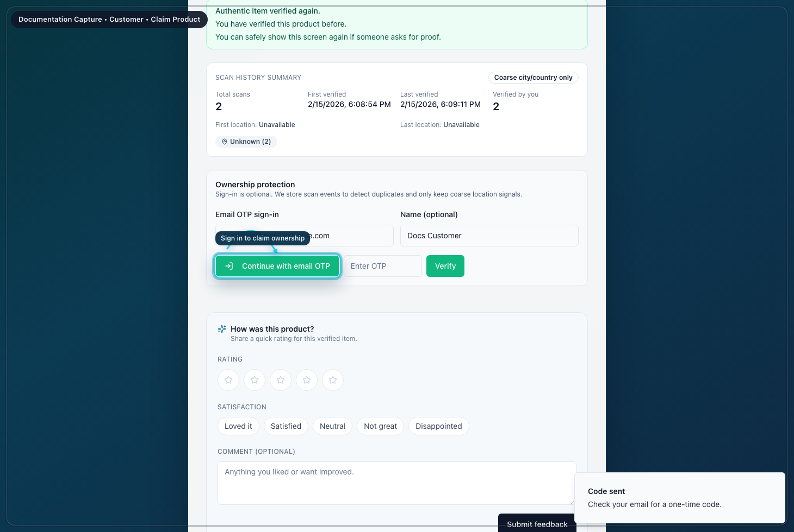

### 7.5 Report Suspected Counterfeit
1. Click `Report suspected counterfeit`.
2. Add what was observed.
3. Optionally attach purchase proof/photos.
4. Submit report.

System behavior:
- Scan metadata (classification, reasons, summary) is attached automatically.
- Incident ticket is created for admin workflow.
- Superadmin alert email is sent through configured email provider.

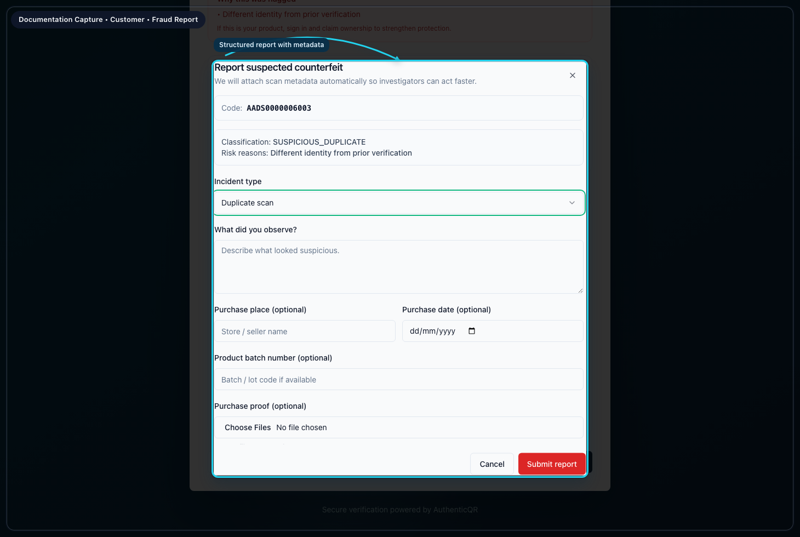

### 7.6 Privacy Note
- Sign-in is optional.
- Platform stores scan events to detect duplicates.
- Coarse location context may be stored; no precise tracking UI is shown to customers.

## 8. Operational SOP

Daily:
1. Licensee Admin reviews pending received inventory.
2. Licensee Admin assigns only required quantity to each manufacturer.
3. Manufacturer creates print jobs only for current production run.
4. Licensee Admin checks audit logs for unexpected batch events.
5. Incident team reviews `Possible Duplicate` customer reports and follows escalation workflow.

Weekly:
1. Review printed vs assigned delta by manufacturer.
2. Investigate repeated scan warnings.
3. Deactivate unused manufacturer accounts.

## 9. Troubleshooting

### Issue: Manufacturers list is empty
Checks:
1. Confirm logged-in user is linked to a licensee.
2. Ensure at least one manufacturer exists under that licensee.
3. Toggle active/all status.
4. Reload page and retry.

### Issue: Batch assignment says insufficient available quantity
Checks:
1. Ensure source batch still has unassigned inventory.
2. Reduce quantity and retry.
3. Refresh to sync latest allocation state.

### Issue: Print job fails
Checks:
1. Verify batch belongs to current manufacturer.
2. Confirm requested quantity does not exceed available unprinted codes.
3. Retry if server reports batch busy/concurrency.

### Issue: Scan shows already redeemed
Meaning:
- Legacy wording has been replaced in current verify UX.
- Same customer/device repeat scans should show `Verified Again`.
- `Possible Duplicate` should appear when identity/device/location patterns look inconsistent.

### Issue: Customer cannot claim ownership
Checks:
1. Confirm customer is signed in (Google or OTP).
2. Verify QR exists and is scannable.
3. If already claimed by another account, escalate through fraud report flow.

### Issue: Customer sees `Possible Duplicate` but owns product
Checks:
1. Ask customer to sign in and claim ownership.
2. Re-scan from the same account/device.
3. If warning persists unexpectedly, collect QR code, timestamp, and report reference for investigation.

## 10. Security Compliance Notes

Implemented controls:
- Signed QR token validation.
- Identity-aware scan classification (`FIRST_SCAN`, `LEGIT_REPEAT`, `SUSPICIOUS_DUPLICATE`).
- Optional customer ownership claim linking.
- Server-side state transitions and audit logging.
- Print job lock and one-time download behavior.
- Rate limiting and scan metadata tracking (including coarse location and hashed IP).

Operational caveat:
- Physical image copying cannot be prevented absolutely.
- System detects and flags reuse so duplicates cannot be validated repeatedly.

## 11. Escalation Matrix

1. Manufacturer operation issue: contact Licensee Admin.
2. Cross-tenant, account, or policy issue: escalate to Super Admin.
3. Persistent API failures: collect timestamp, user ID/email, batch/job ID, and request path for investigation.
