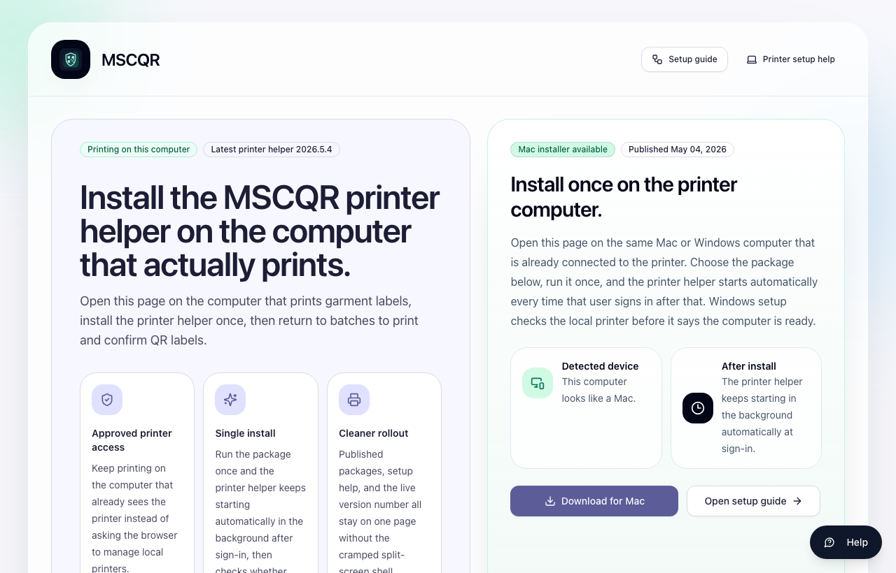
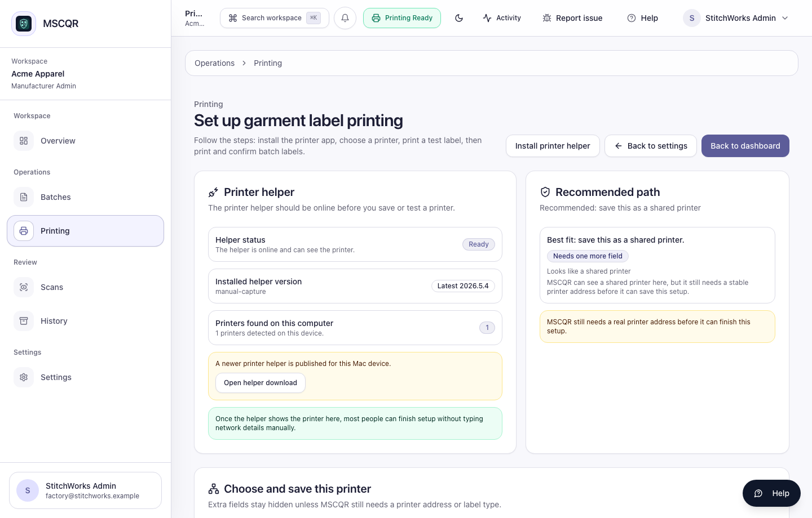

# Manufacturer Printer Setup Guide

## Purpose

Use this guide when a manufacturer workstation needs to print through MSCQR without asking the operator to start any technical service manually.

The standard MSCQR flow is:

1. Install the printer normally in Mac or Windows.
2. Install the MSCQR Connector once on that same computer.
3. Open `Printer Setup` in MSCQR and confirm the printer shows as ready.
4. Print from `Batches`.

After the first install, the connector starts automatically whenever that user signs in.

## First-time setup for a manufacturer workstation

1. On the computer that is physically connected to the printer, open the MSCQR onboarding email or the `Install Connector` page in MSCQR.
2. Choose the correct installer:
   `Mac installer` for macOS
   `Windows package` for Windows PCs
3. Run the installer once.
4. Confirm the printer already appears in the operating-system printer list.
5. Sign in to MSCQR and open `Printer Setup & Support`.
6. Select `Refresh status`.
7. Continue only when MSCQR shows the printer as ready.



## Which printer path should you use?

### `LOCAL_AGENT`

Use this when the printer depends on the workstation that the user is sitting at.

Typical examples:

- USB printers
- desktop printers already added in Mac or Windows
- printers that rely on a local driver or spooler
- vendor-specific printer languages such as SBPL or ESC/POS

What the operator should know:

- install the printer in the operating system first
- install the MSCQR Connector once on that same computer
- the connector then starts automatically in the background

### `NETWORK_DIRECT`

Use this for approved factory label printers that are saved by IP/port and accept raw label commands.

Current supported raw label languages:

- `ZPL`
- `TSPL`
- `EPL`
- `CPCL`

### `NETWORK_IPP`

Use this for office printers, AirPrint printers, and IPP Everywhere printers that accept PDF jobs over IPP or IPPS.

Choose:

- `Backend direct` when the MSCQR backend can safely reach the printer
- `Site gateway` when the printer stays inside a private manufacturer network

## What the operator should see in MSCQR

Open `Printer Setup & Support` and look for a business-safe result:

- `Ready`: the saved printer or workstation printer is good to use
- `Preparing`: MSCQR is still checking the route
- `Offline`: the connector, printer, or gateway is not reachable right now
- `Needs attention`: setup must be corrected before printing

The operator should never need to read ports, localhost addresses, stack traces, or internal system messages.



## Workstation printer checklist

Use this checklist for printers installed directly on the Mac or Windows computer:

1. The printer already works in the operating system.
2. The MSCQR Connector is installed on that same computer.
3. `Printer Setup` shows the connector is reachable.
4. The active workstation printer is the one the operator actually wants to use.
5. `Create Print Job` shows the workstation printer as ready before the run begins.

## Register a factory raw LAN printer

In `Printer Setup`:

1. Add a managed printer profile.
2. Choose `NETWORK_DIRECT`.
3. Enter the approved printer IP address or host and port.
4. Choose the supported command language.
5. Save.
6. Select `Check`.
7. Use the profile only after the status becomes ready.

## Register an office / AirPrint / IPP printer

In `Printer Setup`:

1. Add a managed printer profile.
2. Choose `NETWORK_IPP`.
3. Enter either:
   the full printer URI
   or the host, port, and resource path
4. Enable TLS when the printer supports IPPS.
5. Choose `Backend direct` or `Site gateway`.
6. Save.
7. Select `Check`.

Recommended defaults:

- port `631`
- resource path `/ipp/print`
- `ipps://` when supported

## Private factory network: site gateway setup

Use this only when the printer cannot be reached directly from the MSCQR backend.

1. Register the printer as `NETWORK_IPP`.
2. Choose delivery mode `Site gateway`.
3. Save the profile.
4. Copy the one-time gateway bootstrap secret shown by MSCQR.
5. Add the values below to the connector `agent.env` file on the trusted site workstation.
6. Restart the connector or reinstall it through the packaged installer.
7. Return to `Printer Setup` and confirm the profile changes to `Site gateway online`.

```dotenv
PRINT_GATEWAY_BACKEND_URL=https://your-mscqr-host/api
PRINT_GATEWAY_ID=<gateway-id>
PRINT_GATEWAY_SECRET=<one-time-bootstrap-secret>
```

## Before live printing

Confirm all of the following:

1. The printer profile or workstation printer is `Ready`.
2. The operator sees the correct saved printer name before they start.
3. A small test run completes successfully.
4. Printed counts update inside MSCQR.
5. If anything looks wrong, stop and correct setup before the production run.


## Troubleshooting

If printing does not start:

1. Open `Printer Setup`.
2. Read the business-safe status.
3. If the connector is missing, return to `Install Connector` and install it on that computer.
4. If the printer is missing, confirm it still appears in the operating system.
5. If a saved network printer is not ready, run `Check` again.
6. Copy the support summary and send it to support if the issue continues.

## Lightsail and Docker note

If MSCQR is deployed on AWS Lightsail with Docker Compose:

- use `docker compose`, not `systemctl`
- use the Lightsail browser terminal opened with `Connect using SSH`
- confirm the Git commit on Lightsail matches the Git commit on your local machine before and after the update
