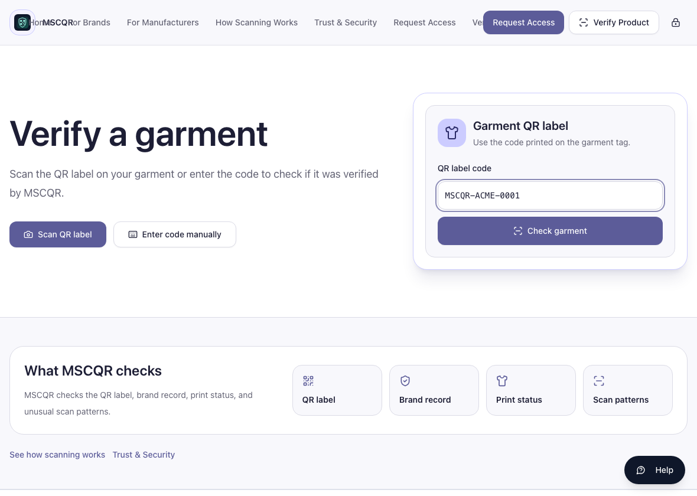
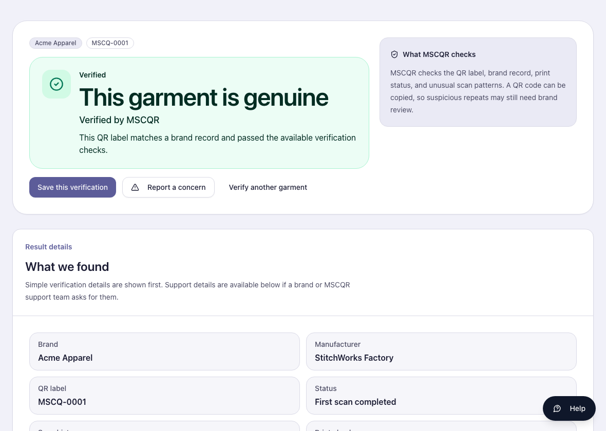
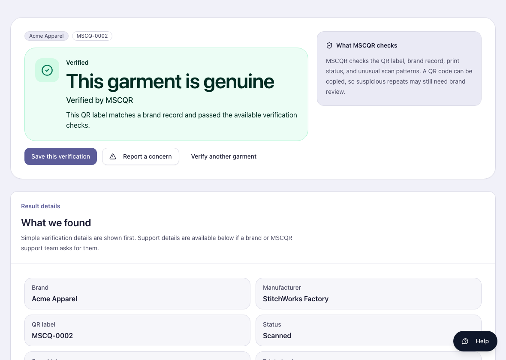
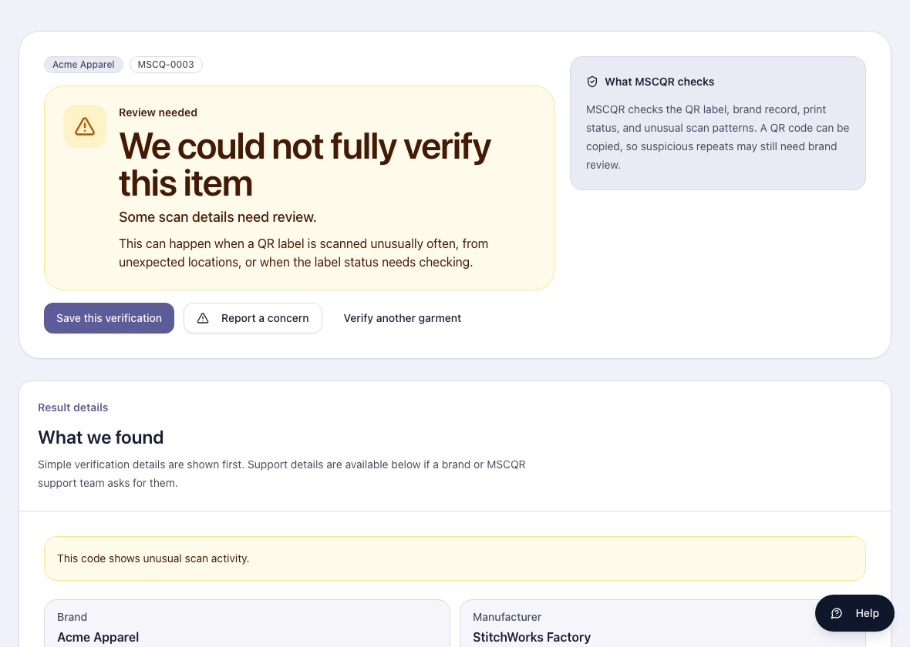
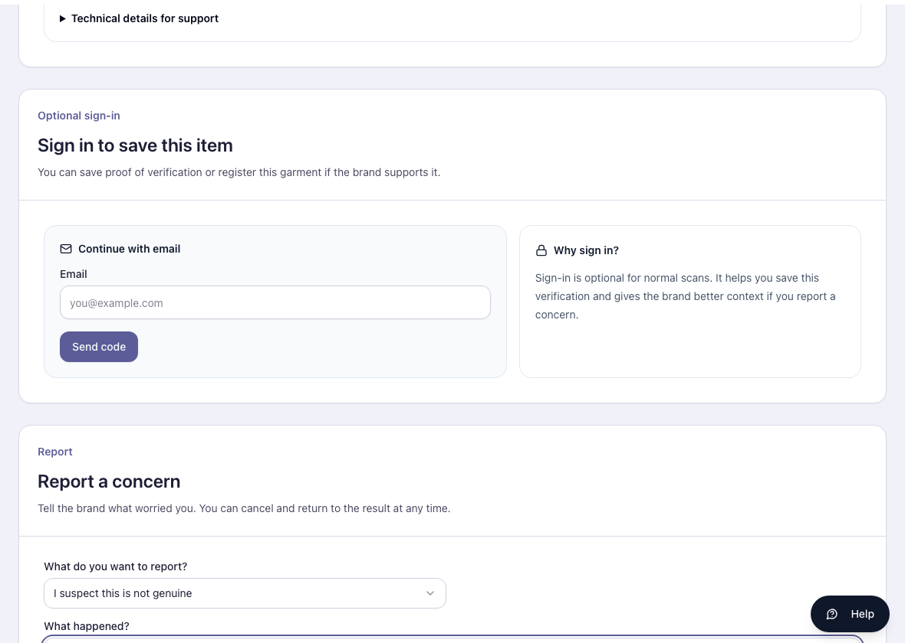

# MSCQR Customer Verification User Manual

Audience: Customer / Product Verifier  
Website manual: https://www.mscqr.com/help/customer  
Last updated: May 4, 2026

## Purpose
Use this manual to check a garment QR label with the current MSCQR public verification page. It explains how to start a check, read the result, and report a concern.

## Access And Prerequisites
- You do not need an operator account to open the public verify page.
- You need the QR label or the printed code from the garment tag.
- Camera scanning depends on browser support. Manual code entry works on every device.
- MSCQR records scan events to help detect unusual repeated use and support investigations.

## 1. Start Verification
Open `https://www.mscqr.com/verify`, then scan the QR label or enter the code manually.

Steps:
1. Select `Scan QR label` if your device and browser support camera capture.
2. Or select `Enter code manually` and type the code printed on the garment tag.
3. Select `Check garment`.
4. Wait for the result page.

## 2. Read A Verified Result
A normal successful result appears as `This garment is genuine` with `Verified by MSCQR`.

Read the page in this order:
1. Main result banner.
2. Result details.
3. Brand and manufacturer details.
4. Scan summary.
5. Support contact.

## 3. Read A Repeat Verification
A repeat check can still show a successful result when the scan pattern looks normal.

A repeat result means the code has been checked before. This can be normal, especially if you scan your own product again. Review the scan summary if you want more context.

## 4. Read A Review-Required Result
If MSCQR cannot fully verify the item, the page shows a review-needed result.

This does not automatically prove the product is fake. It means the scan details need review before you rely on the result.

Check:
- whether the label or packaging looks altered
- whether the seller details match the product
- whether the scan summary shows unusual activity
- whether the brand support details are available

## 5. Report A Concern
Use `Report a concern` if the product, seller, label, or result looks suspicious.

Steps:
1. Select `Report a concern`.
2. Choose the reason that best matches the issue.
3. Describe what happened.
4. Submit the concern.
5. Keep any support reference shown by MSCQR.

## What To Do If Something Looks Wrong
- Code not found: check the printed code and try again. Report a concern if the tag looks suspicious.
- Camera scan fails: enter the code manually.
- Review-needed result: do not rely on the item until you review the details or contact the brand.
- Service unavailable: retry later or contact the brand support shown on the page.
- You submitted a concern: keep the support reference for follow-up.

## Glossary
- QR label: the MSCQR code printed on the garment tag.
- Manual code entry: typing the printed code instead of scanning.
- Scan summary: a record of first and latest verification activity shown to help you understand the result.
- Review-needed result: MSCQR needs the brand or support team to review unusual scan details.
- Support reference: the case reference returned after submitting a concern.

## CTO Recommendations
- Next best feature: add a customer-safe downloadable verification receipt.
- Security hardening: add abuse-resistant concern reporting with stronger rate-limit feedback and attachment scanning.
- Scalability: add localized customer manual pages for the main regions where MSCQR garments are sold.
