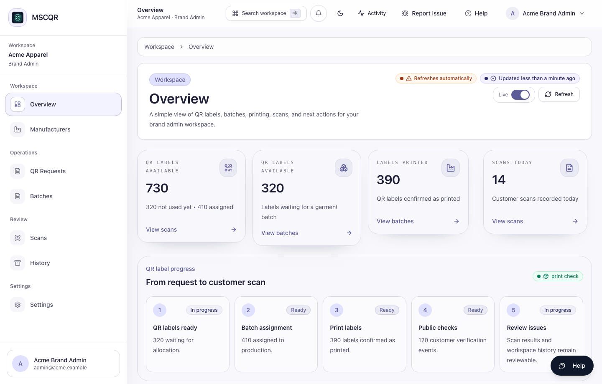
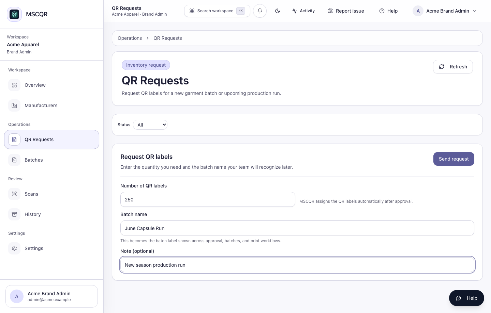
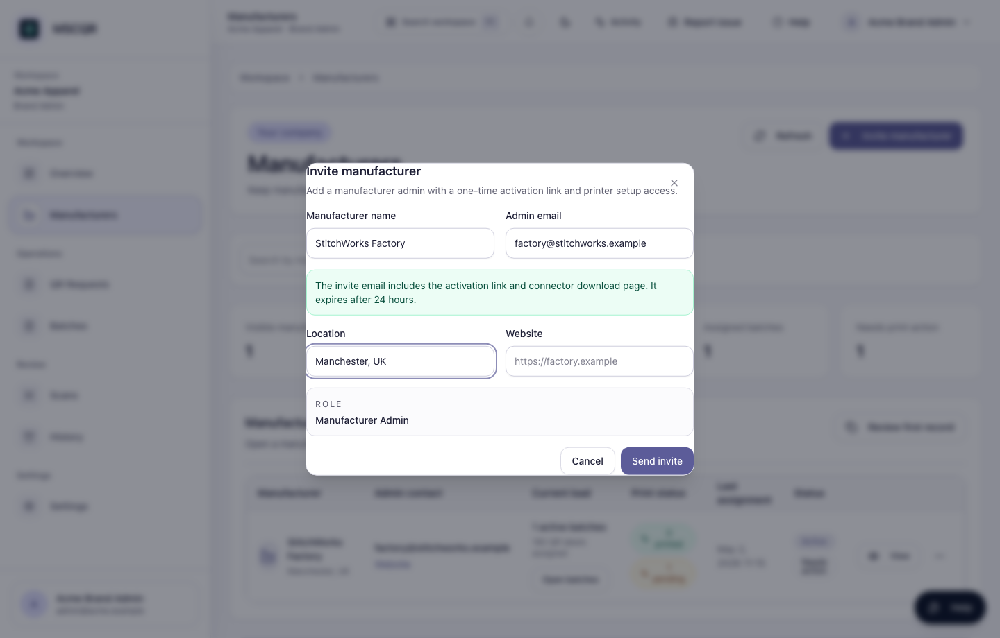
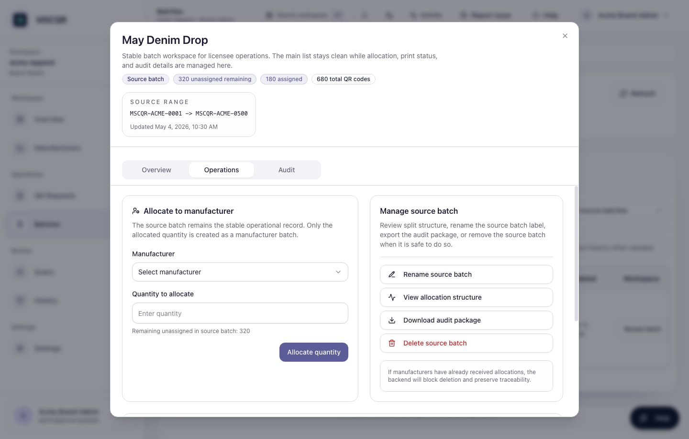
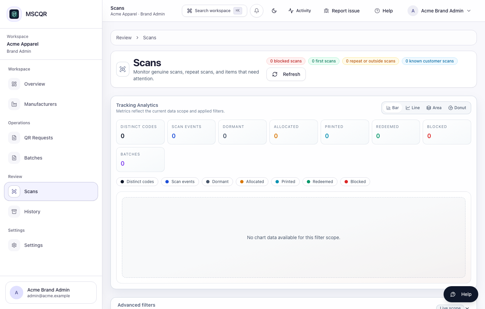
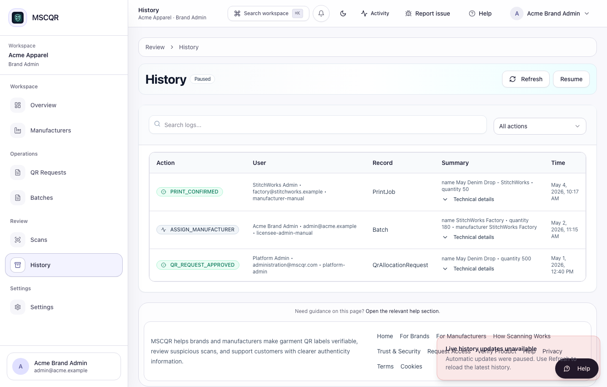

# MSCQR Licensee Admin User Manual

Audience: Licensee Admin / Brand Admin  
Website manual: https://www.mscqr.com/help/licensee-admin  
Last updated: May 4, 2026

## Purpose
Use this manual to operate the current MSCQR Licensee Admin workspace. It covers the workflows implemented in the current UI: signing in, checking the overview, requesting QR labels, inviting manufacturers, allocating batches, reviewing scan activity, and checking history.

## Access And Prerequisites
- You need an active Licensee Admin account for your company.
- New users receive an invite link and set their password before signing in.
- Your account is scoped to your own company. You cannot see other licensees.
- Use the top-bar Help control to open the matching website manual page for the screen you are using.

## 1. Start From Overview
Open `Overview` after signing in. Confirm the current QR label totals, printed label count, scan count, and recent workspace activity before requesting more labels or assigning stock.

Recommended order:
1. Check QR labels available.
2. Check labels printed and scans today.
3. Review recent activity for unexpected changes.
4. Move to `QR Requests`, `Batches`, or `Manufacturers` only after confirming the current position.

## 2. Request QR Labels
Open `QR Requests` when your company needs more labels for a production run.

Steps:
1. Enter the number of QR labels needed.
2. Enter a clear batch name that your team will recognize later.
3. Add an optional note for the approver.
4. Select `Send request`.
5. Track the request in the request history table.

After approval, MSCQR allocates the labels and the approved source batch appears in `Batches`.

## 3. Invite A Manufacturer
Open `Manufacturers` to add factory admin users who will receive assigned batches and manage printing.

Steps:
1. Select `Invite manufacturer`.
2. Enter the manufacturer name and admin email.
3. Add location and website if available.
4. Select `Send invite`.

The invite email includes the activation link and printer helper download page. Do not share one account across factories or users.

## 4. Allocate A Batch To A Manufacturer
Open `Batches`, then open the source batch workspace. The current UI keeps one stable row per source batch; manufacturer allocations are managed inside the workspace.

Steps:
1. Find the approved source batch.
2. Select `Open`.
3. Open the `Operations` tab.
4. Choose the manufacturer.
5. Enter the quantity to allocate.
6. Select `Allocate quantity`.
7. Use `Overview` and `Audit` in the same workspace to confirm the result.

Only allocate the quantity that should move to that manufacturer now. The remaining unassigned quantity stays on the source batch.

## 5. Review Scan Activity
Open `Scans` to review verification activity for your company.

Use this page to:
- search by QR code, batch, status, or date range
- review first scans and repeated scans
- identify items that need review
- keep allocation context before escalating an issue

## 6. Review History
Open `History` to inspect workspace events such as approvals, assignments, print confirmations, and verification activity.

Use `History` when you need to confirm who did what and when. Expand details only when you need additional record context for investigation.

## What To Do If Something Looks Wrong
- Manufacturer cannot see a batch: open `Manufacturers`, confirm the manufacturer account is active, then open that manufacturer’s batches.
- Allocation quantity fails: reopen the source batch workspace and check the remaining unassigned quantity.
- QR request is missing: clear filters in `QR Requests`, then refresh.
- Recent audit history is missing: refresh `History` or the batch workspace `Audit` tab.
- UI or workflow error: use the top-bar support reporter so MSCQR attaches diagnostics and a screenshot.

## Glossary
- Source batch: the approved label inventory received by the licensee.
- Manufacturer allocation: a quantity split from a source batch for a manufacturer to print.
- QR request: a request for more QR labels.
- Scan activity: customer verification events and related review signals.
- History: audit records for operational actions.

## CTO Recommendations
- Next best feature: add role-safe export bundles from `Scans` and `History` for licensee audits.
- Security hardening: add tenant-level approval thresholds for unusually large QR label requests.
- Scalability: add saved filters for high-volume licensees that review many batches daily.
