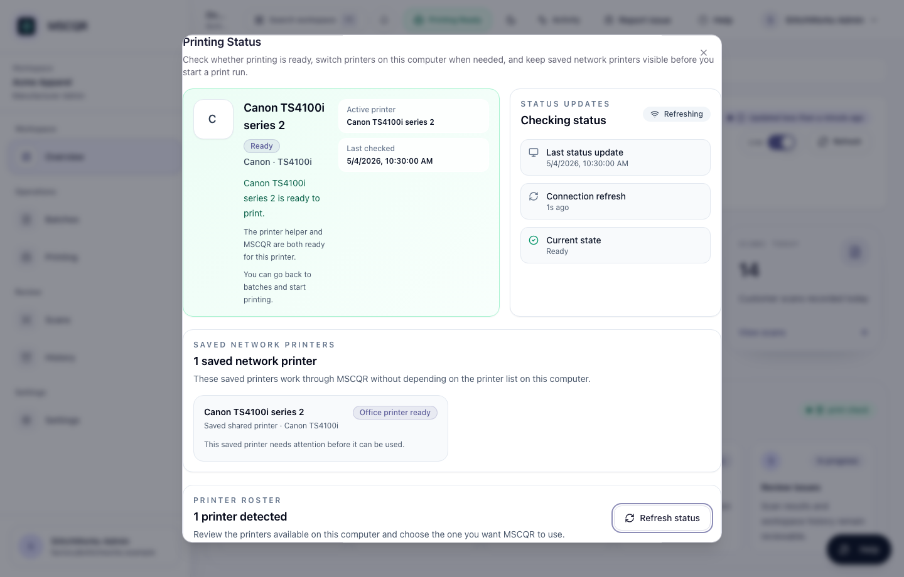
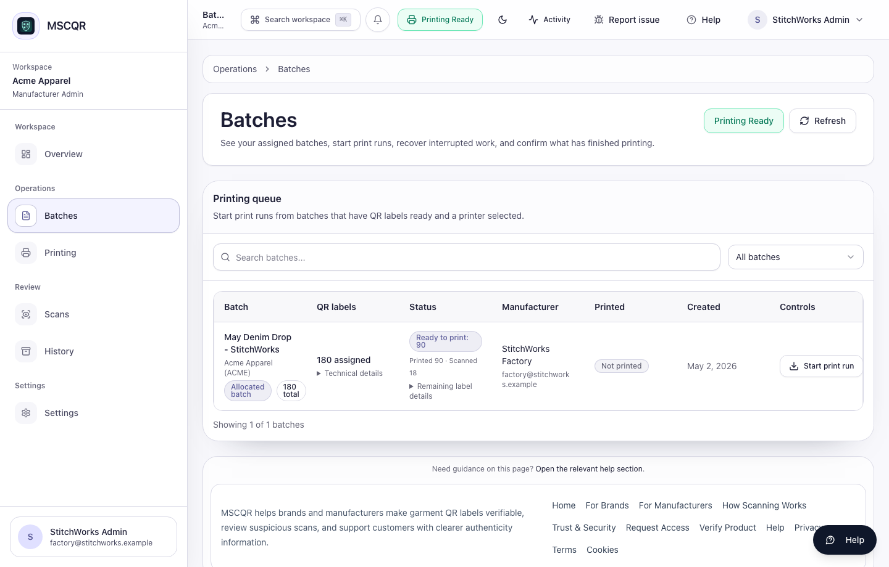
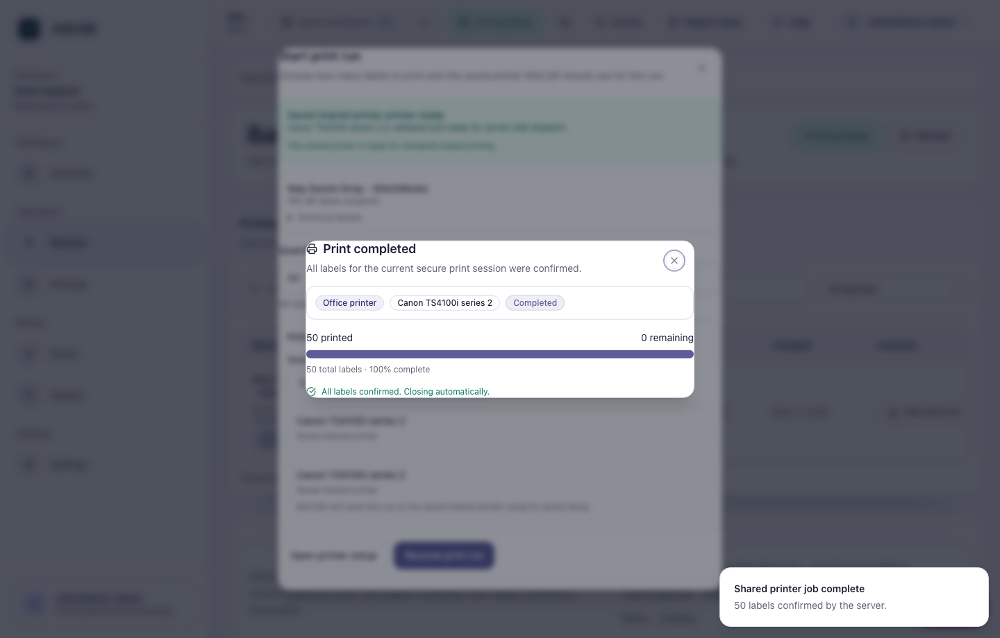

# MSCQR Manufacturer User Manual

Audience: Manufacturer Admin  
Website manual: https://www.mscqr.com/help/manufacturer  
Last updated: May 4, 2026

## Purpose
Use this manual to operate the current MSCQR Manufacturer workspace. It covers the workflows implemented in the current UI: signing in, reviewing assigned batches, installing the printer helper, checking printer readiness, creating controlled print jobs, and confirming print status.

## Access And Prerequisites
- You need an active Manufacturer account invited by a Licensee Admin or platform operator.
- You can only see batches assigned to your manufacturer account.
- The computer used for printing must already be able to see the printer in Windows or macOS.
- Install the MSCQR printer helper once on the computer that actually prints labels.

## 1. Start From Overview
Open `Overview` after signing in to confirm assigned work, print activity, and scan activity for your manufacturing scope.

Use this page to confirm that you are working in the correct brand workspace before opening `Batches`.

## 2. Install The Printer Helper
Open `Install Connector` on the computer that will print labels.

Steps:
1. Open the page on the printer computer.
2. Download the Mac or Windows installer for that computer.
3. Run the installer once.
4. Confirm the helper starts automatically after sign-in.
5. Return to MSCQR and open `Printing` to check readiness.

## 3. Check Printer Readiness
Open `Printing` before a production run. Confirm the saved printer profile is active and ready.

MSCQR supports the current implemented print paths:
- `LOCAL_AGENT`: workstation-managed printers through the installed printer helper.
- `NETWORK_DIRECT`: controlled LAN label printers registered as approved profiles.
- `NETWORK_IPP`: office / AirPrint / IPP printers registered as approved profiles.

Browser ZIP or image-pack printing is not the current production workflow.

## 4. Review Assigned Batches
Open `Batches` to see work assigned to your manufacturer account.

Use the table to check:
- batch name
- assigned QR label quantity
- ready-to-print count
- printed count
- scan count
- batch status

If no batch appears, ask the Licensee Admin to confirm the assignment.

## 5. Create A Print Job
Select `Create Print Job` from the assigned batch row.

Steps:
1. Enter the quantity to print.
2. Confirm the registered printer profile.
3. Read the readiness message.
4. Select `Start print`.

Only start the job when the printer profile matches the physical printer you intend to use.

## 6. Confirm Print Status
After starting a job, MSCQR shows print progress and recent print job status.

Confirm:
- the printer name is correct
- the printed count increases as expected
- the job reaches a completed or confirmed state
- the batch row updates after refresh

If a job fails or stalls, do not repeatedly restart it. Check `Printing`, refresh readiness, then retry only after the problem is clear.

## What To Do If Something Looks Wrong
- Batch not visible: ask the Licensee Admin to verify that the batch is assigned to your manufacturer account.
- Printer helper not detected: confirm the helper is installed and running on the printer computer.
- Printer profile not ready: open `Printing`, check the saved profile, and rerun readiness checks.
- Printed count does not update: refresh once, then contact support with the batch name, printer name, and time.
- Wrong printer selected: stop before printing, choose the correct profile, and restart the workflow.

## Glossary
- Printer helper: the MSCQR local helper installed on the computer that prints labels.
- Registered printer profile: a saved printer route MSCQR can use for controlled printing.
- Assigned batch: QR label inventory allocated to your manufacturer account.
- Print job: a controlled request to print a specific quantity from an assigned batch.
- Printed count: labels MSCQR has recorded as printed or confirmed.

## CTO Recommendations
- Next best feature: add a manufacturer-facing print run checklist with operator acknowledgement before `Start print`.
- Security hardening: require step-up verification for high-volume reprints or printer profile changes.
- Scalability: add queue grouping by production line or printer profile for factories with multiple workstations.
