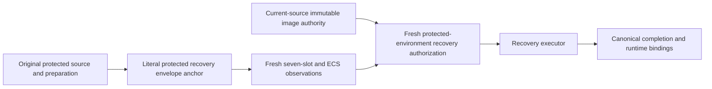

# MSCQR partial rebaseline successor recovery

This is a terminal, one-transition recovery bridge for the authenticated
`rotation-20260829015311-765c8a16` partial rebaseline incident. It does not
generalize source rebinding or create replacement material or VersionIds.

The literal envelope binds the original source, preparation and material-journal
identities, all seven resources, historical and target identities, and the
only permitted completed/remaining partition. It is authority because its
SHA-256 is reviewed protected source; the envelope's own hash is integrity
only. The old authorization is historical evidence only.

At execution, each slot must be either the exact original historical identity
or the exact original target identity. Progress is determined by fresh live
state, never by a supplied completed-slot declaration. Completed slots are
not written; historical slots can receive at most the original deterministic
write. A successful write uses bounded read-only convergence and no write
retry. Any third, substituted, malformed, or staging-incompatible state fails
closed.

The fresh authorization binds the final protected source, current image
authority, live CAS identities, repository/account/region, actual protected
environment approval, and the one recovery reason. Git ancestry is only a
necessary eligibility check; it is never execution authority. Completion
binds both the final source and the preserved original transition, after all
seven exact target identities are observed.

After canonical completion, the bridge allows zero further writes. It cannot
authorize another rotation, preparation, resource set, or successor source.
Remove the protected-source bridge only after the recovery completion and its
downstream Stage-B closure have been independently authenticated.
