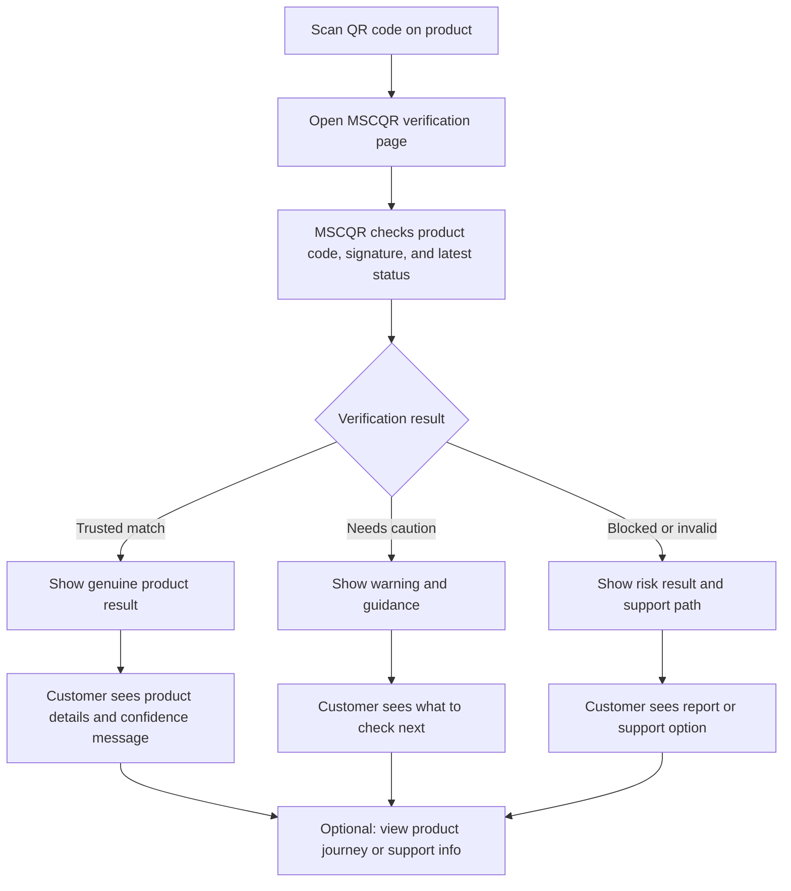

# Customer Verification Workflow

## Notes

- The customer flow should stay simple and trust-focused.
- The page explains the result, not the backend mechanics.
- If the result is risky, the customer gets a clear next step instead of a technical error.
