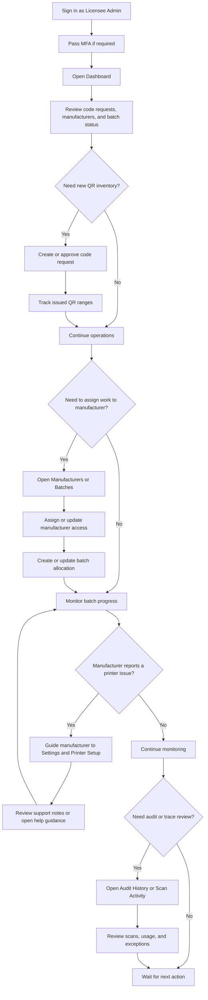

# Licensee Admin Workflow

## Notes

- Licensee admins manage manufacturers, batches, and QR allocation.
- They do not print labels themselves unless the business process allows it.
- Sensitive changes still require fresh verification where applicable.
