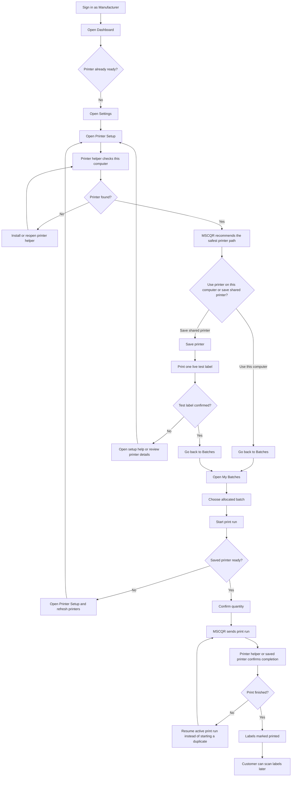

# Manufacturer Workflow

## Notes

- Manufacturers stay inside the normal batch workflow after setup.
- Duplicate print runs are blocked by design.
- A label is only marked printed after printer confirmation.
