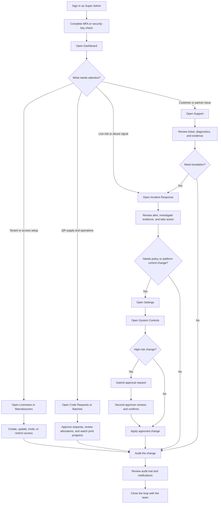

# Super Admin Workflow

## Notes

- Super Admin owns platform-wide access, incident response, and governance.
- The highest-risk changes can require two-person approval.
- Audit and evidence review are part of the normal workflow, not an afterthought.
